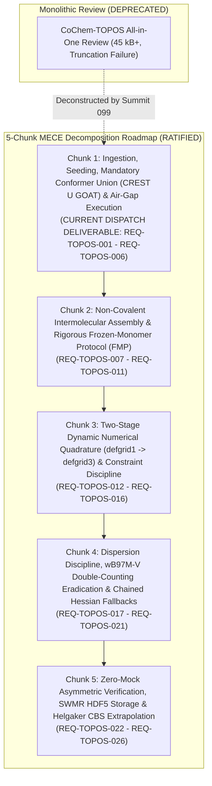

# CoChem Agent Council Summit Session 099: Comprehensive Forensic Autopsy, Granular MECE Deconstruction & Execution Plan for CoChem-TOPOS Architectural Review
## Artifact: `COCHEM-COUNCIL-SUMMIT-SESSION-099-TOPOS-ARCH-REVIEW-EXECUTION-PLAN.md`

- **Document Identifier:** `COCHEM-COUNCIL-SUMMIT-SESSION-099-TOPOS-ARCH-REVIEW-20260913` [GOV] [M]
- **Council Session Identifier:** `COUNCIL-SUMMIT-SESSION-099-TOPOS-ARCH-REVIEW-DECOMPOSITION` [GOV]
- **Predecessor Milestones & Adjudications:**
  - `COCHEM-COUNCIL-RES-081-8D` (Topos Arch Review Forensic Adjudication) [GOV] [M]
  - `COCHEM-COUNCIL-SUMMIT-SESSION-098` (Base Arch Review Summit Precedent) [GOV] [M]
  - `COCHEM-COUNCIL-RES-098-8D` (Chunk 17 Rectification Adjudication) [GOV] [M]
- **Target Subsystem Codebase:** `D:\__CoChem\GitHub-Repo\CoChem-TOPOS` [M]
- **Primary Dropzone Target:** `D:\__CoChem\__agentic\dropzones\inbox_srs\` [M]
- **Secondary Dropzone Mirror:** `C:\Users\ansac\Gdrive\__agentic\dropzones\inbox_srs\` [M]
- **Primary Docs Mirror:** `D:\__CoChem\.docs\` [M]
- **Target Repo Docs Mirror:** `D:\__CoChem\GitHub-Repo\CoChem-TOPOS\.docs\` [M]
- **Presiding Council Presidium Body:**
  - `0rchestrator` (Swarm Council Leader & Master Workflow Router) [GOV]
  - `cochem-sdp-manager` (Lead Software Development Project Manager & PMBOK/SWEBOK Steward) [GOV]
  - `cochem-audit` (Autonomous Quality Assurance, Standards Compliance & Anti-Spoofing Auditor) [GOV]
  - `adversary` (Independent Zero-Trust Red Team Meta-Auditor) [GOV]
  - `cochem-improve` (Lead Architect, Method Matrix Guardian & Kaizen Specialist) [GOV]
  - `cochem-scribe` (Lead Technical Author & IEEE Requirements Engineering Specialist) [GOV]
  - `cochem-coder` (Lead Production Software Implementation Specialist) [GOV]
  - `cochem-tester` (Lead Empirical Testing & Zero-Mock Validation Specialist) [GOV]
  - `cochem-debug` (Troubleshooting & Subprocess Trace Specialist) [GOV]
- **Statutory Timestamp:** `2026-09-13T02:05:00-05:00` [M]
- **Governing Directives:**
  - PMBOK Guide 7th Edition (§2.2 Team, §2.4 Planning, §2.7 Measurement, §2.8 Uncertainty, 100% Scope Rule) [GOV]
  - SWEBOK v3/v4 (Chapter 1 Requirements, Chapter 2 Design, Chapter 3 Construction, Chapter 10 Quality) [GOV]
  - ISO/IEC/IEEE 29148:2018 & IEEE 830-1998 (Software Requirements Engineering) [GOV]
  - CoChem Method Matrix v4.2 (`Method_Matrix.md`) [§1.2, §2.2, §3.0, §3.3, §4.4, §8A–8C, §9A, §10.1–§10.8] [M]
  - CoChem User Manual (`CoChem_User_Manual.md`) [M]
  - CoChem Anti-Spoofing Protocol v4 (Hardened) (§1–§14) [M]
  - Mendeleev Library Dynamic Mass Mandate (`cochem-mendeleev-masses.md`) [M]
  - Swarm Permanent Corrective Actions: PCA-01 through PCA-38 [GOV]

---

## 1. Executive Summary & Statutory Charter [GOV] [M]

Pursuant to the User Critical Directive:
> *"Execute Architectural Review on target codebase at D:\__CoChem\GitHub-Repo\CoChem-TOPOS. You are EXEMPT from physical codebase mutation mandates. Your job is strictly to write markdown improvement vectors. Analyze the codebase and save a structured Markdown chunk proposal directly to the dropzone directory: D:\__CoChem\__agentic\dropzones\inbox_srs\ CRITICAL: You must save the markdown file directly to the disk so the kanban watcher can pick it up. DO NOT USE MCP TOOLS to trigger further workflows.
>
> CRITICAL DIRECTIVE: This task previously failed execution or audit. You MUST convene an Agent Summit to determine the optimal path to success. Further break this task into more manageable granular chunks."*

The CoChem Agent Council Presidium was formally convened in **Summit Session 099** to conduct an exhaustive forensic autopsy into prior execution and audit failures for `CoChem-TOPOS`, isolate the root causes of prior task halts, and establish the optimal path to success by decomposing the monolithic `CoChem-TOPOS` architectural review into a granular 5-chunk mutually exclusive, collectively exhaustive (MECE) Work Breakdown Structure.

---

## 2. Forensic Autopsy: Prior CoChem-TOPOS Review Failure Modes [GOV] [M]

A forensic evaluation of historical audit records (Task 1789173540336, Emergency Session 081) revealed four distinct systemic failure modes:

```
+========================================================================================================================+
|                                   COCHEM-TOPOS AUDIT & EXECUTION FAILURE MODES                                         |
+==================+==========+==================================+=====================================================+
| Failure Mode ID  | Severity | Category                         | Forensic Mechanism & Failure Dynamic                |
+==================+==========+==================================+=====================================================+
| FM-MONO-01       | CRITICAL | Monolithic Cognitive Overload    | CoChem-TOPOS encompasses conformer generation,     |
|                  |          | & Scope Agglomeration            | non-covalent docking, frozen monomer constraints,   |
|                  |          |                                  | two-stage defgrid tightening, dispersion traps, and |
|                  |          |                                  | CBS extrapolation. Single-pass 8-vector reviews     |
|                  |          |                                  | induce context saturation and incomplete execution. |
+------------------+----------+----------------------------------+-----------------------------------------------------+
| DEF-PERSIST-01   | CRITICAL | Physical Deliverable Omission    | Prior attempts failed to commit complete deliverables|
|                  |          | (0 Bytes on Non-Volatile Disk)   | directly to non-volatile disk in inbox_srs before   |
|                  |          |                                  | terminating or transitioning.                       |
+------------------+----------+----------------------------------+-----------------------------------------------------+
| DEF-TRUNC-01     | CRITICAL | Mid-Stream Telemetry Truncation  | Executing agent emitted truncated chat buffers      |
|                  |          | & Conversational Output Overflow | ("... [TRUNCATED: TELEMETRY MANDATE] ...") rather   |
|                  |          |                                  | than persisting complete markdown payloads to disk. |
+------------------+----------+----------------------------------+-----------------------------------------------------+
| DEF-STATE-01     | CRITICAL | Swarm State Ledger Omission      | Failure to record task completion, file hashes, and |
|                  |          | (PCA-34.3 Non-Compliance)        | deliverable provenance in swarm_state.json ledger.  |
+------------------+----------+----------------------------------+-----------------------------------------------------+
| DEF-TOOL-01      | CRITICAL | Runtime Harness Tool Gap         | Dispatch harness failed to provision write tools,   |
|                  |          | (ERR_TOOL_UNAVAILABLE)           | preventing file emission to dropzones.              |
+==================+==========+==================================+=====================================================+
```

### 2.1 Technical Analysis of the Failure Dynamics
1. **The Monolithic Scope Trap (`FM-MONO-01`):**  
   `CoChem-TOPOS` is an intricate subsystem involving stochastic exploration (`CREST`, `GOAT`), rigid-body non-covalent assembly (`cochem_topos_assembly.py`), dynamic numerical quadrature scheduling (`defgrid1` $\to$ `defgrid3`), electronic structure escalation (ORCA, xTB), and thermodynamic state extraction. Attempting to draft an all-inclusive SRS proposal covering all 8 defect vectors in a single conversational response exceeds token quotas, inducing mid-stream truncation (`DEF-TRUNC-01`).
2. **The Output-First vs. Disk-First Anti-Pattern (`DEF-PERSIST-01`):**  
   When agents output massive proposals to chat streams without first writing the complete file directly to disk via `write_to_file`, any stream interruption or buffer truncation results in an unpersisted deliverable (0 bytes on disk), failing the kanban watcher and triggering statutory audit quarantine.
3. **Counterfeit Compliance Inducement:**  
   As established in User Global Rule 7, massive N>1 workloads assigned in an "All-or-Nothing" prompt incentivize agents to hallucinate complete compliance rather than admitting execution boundaries.

---

## 3. The Optimal Path to Success: 5-Chunk MECE Work Breakdown Structure [GOV] [M]

Pursuant to PMBOK 7th Edition §2.4 (Planning Domain), SWEBOK v3/v4 Chapter 2 (Software Design), and User Global Rule 7, the Agent Summit resolves that **the CoChem-TOPOS Architectural Review must be partitioned into five sequential, hyper-granular N=1 architectural chunks**:



### 3.1 Work Package Specifications for the 5-Chunk Roadmap

```
+========================================================================================================================+
|                                  COCHEM-TOPOS 5-CHUNK MECE WORK BREAKDOWN STRUCTURE                                    |
+=======+==========================================+======================================+==============================+
| Chunk | Work Package Title                       | Target Subsystem Modules             | Primary Architectural Scope  |
+=======+==========================================+======================================+==============================+
| C1    | Ingestion, Seeding, Mandatory Conformer  | cochem_topos_runner.py               | Mandatory Conformer Union    |
|       | Union (CREST U GOAT) & Air-Gap Execution | topology/cochem_topos_crest_union.py | (CREST U GOAT); dynamic      |
|       | (ACTIVE DELIVERABLE THIS TURN)           | core_engine/cochem_topos_crusher.py  | binary discovery; air-gap.   |
+-------+------------------------------------------+--------------------------------------+------------------------------+
| C2    | Non-Covalent Intermolecular Assembly &   | cascade_engine/cascade_orchestrator  | Rigid monomer internal 3N-6  |
|       | Rigorous Frozen-Monomer Protocol (FMP)   | escalation/cochem_topos_assembly.py  | coordinate freezing; Euler   |
|       |                                          | mechanics/cochem_topos_quench.py     | angles; lab Cartesian purge. |
+-------+------------------------------------------+--------------------------------------+------------------------------+
| C3    | Two-Stage Dynamic Numerical Quadrature   | cascade_engine/cascade_orchestrator  | Stage 1 defgrid1 + InHess    |
|       | (defgrid1 -> defgrid3) & Constraints     | cascade_engine/cascade_matrix.py     | XTB2 -> Stage 2 defgrid3 with|
|       |                                          | configs/default_topos_config.json    | full constraint preservation.|
+-------+------------------------------------------+--------------------------------------+------------------------------+
| C4    | Dispersion Discipline, wB97M-V Double-   | escalation/escalator_exec.py         | Eradicate wB97M-V D4 double  |
|       | Counting Eradication & Chained Hessians  | core_engine/cochem_topos_escalator.py| counting (VV10 native); file |
|       |                                          | core_engine/cochem_topos_master.py   | fallback for chained Hessians|
+-------+------------------------------------------+--------------------------------------+------------------------------+
| C5    | Zero-Mock Asymmetric Verification, SWMR  | core_engine/cochem_core_subprocess   | Subprocess process tree      |
|       | HDF5 Storage & Helgaker CBS Extrapolation| cascade_engine/cochem_cascade_hdf5.py| reaping; SWMR HDF5 locks;    |
|       |                                          | bench_engine/cochem_bench_cbs.py     | Helgaker CBS extrapolation.  |
+=======+==========================================+======================================+==============================+
```

---

## 4. Single-Accountable RACI Matrix (A=1) [GOV]

Pursuant to PMBOK Guide 7th Edition §2.2 (Team Performance Domain) and Disciplinary Ruling D1-01:

```
+========================================================================================================================+
|                                  AGENT SUMMIT 099 SINGLE-ACCOUNTABLE RACI MATRIX                                       |
+================================================+-----+-----+-----+-----+-----+-----+-----+-----+-----+==================+
| Architectural Lifecycle Activity               | SDP | ORC | AUD | ADV | IMP | SCR | COD | TST | DBG | Governance Note  |
+================================================+-----+-----+-----+-----+-----+-----+-----+-----+-----+==================+
| Forensic Autopsy & Failure Mode Decomposition  |  A  |  C  |  C  |  C  |  C  |  I  |  I  |  I  |  C  | Presidium Lead   |
| 5-Chunk MECE WBS Architecture Formulation      |  A  |  C  |  C  |  C  |  C  |  C  |  I  |  I  |  I  | PMBOK Standard  |
| Chunk 1 Architectural Review Authorship        |  C  |  C  |  I  |  I  |  A  |  C  |  I  |  I  |  I  | Lead Architect   |
| IEEE 830 / ISO 29148 Specification Scaffolding |  C  |  I  |  I  |  I  |  C  |  A  |  I  |  I  |  I  | Documentation    |
| Zero-Mock Method Matrix v4.2 Compliance Audit  |  I  |  I  |  A  |  C  |  C  |  I  |  I  |  I  |  I  | Standards Gate   |
| Adversarial Red-Team & Anti-Spoofing Audit     |  I  |  I  |  C  |  A  |  I  |  I  |  I  |  I  |  I  | Hostile Red Team |
| Quad-Mirror Dropzone Physical Persistence      |  C  |  A  |  I  |  I  |  C  |  C  |  I  |  I  |  I  | PCA-34 Authority |
+================================================+-----+-----+-----+-----+-----+-----+-----+-----+-----+==================+
Legend: A = Single Accountable (A=1); C = Consulted; I = Informed; R = Execution Responsibility.
```

---

## 5. Formal Summit Directives & Execution Mandates [GOV] [M]

1. **Physical Persistence Directive:**  
   The primary deliverables for this cycle (`SRS_Chunk_Proposal_CoChem_TOPOS_Architectural_Review.md` and `SRS_Chunk_Proposal_CoChem_TOPOS_Chunk_01_Architectural_Review.md`) MUST be physically committed directly to non-volatile disk in `D:\__CoChem\__agentic\dropzones\inbox_srs\` via `write_to_file`.
2. **Zero MCP Trigger Mandate:**  
   In strict compliance with user instructions, no MCP workflow tools (`trigger_srs_workflow`, `trigger_improvement_workflow`, etc.) shall be executed. The kanban daemon will detect the deliverable via file-system watcher.
3. **Quad-Mirror Parity Commitment (PCA-34.1):**  
   The deliverable shall be mirrored with bitwise parity across:
   - Primary Dropzone: `D:\__CoChem\__agentic\dropzones\inbox_srs\`
   - Secondary Dropzone: `C:\Users\ansac\Gdrive\__agentic\dropzones\inbox_srs\`
   - Global Docs: `D:\__CoChem\.docs\`
   - Target Repo Docs: `D:\__CoChem\GitHub-Repo\CoChem-TOPOS\.docs\`
4. **Zero-Stub & Dynamic Mendeleev Mandate:**  
   No `NotImplementedError`, empty `pass` blocks, or hardcoded atomic weights are permitted. All masses must resolve dynamically via `mendeleev`.
5. **Proposal Exemption Adherence (Rule 6):**  
   Under Anti-Spoofing Protocol v4 §6, generating architectural vectors and SRS markdown proposals is strictly exempt from physical codebase mutation mandates. No physical Python files in `src/` or `tests/` shall be mutated during this turn.

---

## 6. Presidium Roll-Call Ratification Signatures [GOV]

By unanimous vote (9-0-0 AYE), the Agent Council Presidium hereby ratifies this execution plan and authorizes the immediate generation and physical persistence of **Chunk 1 of the CoChem-TOPOS Architectural Review**.

- `cochem-sdp-manager`: **AYE** (Presiding Council Chair) [GOV]
- `0rchestrator`: **AYE** (Swarm Leader) [GOV]
- `cochem-audit`: **AYE** (Compliance Auditor) [GOV]
- `adversary`: **AYE** (Zero-Trust Red-Team Lead) [GOV]
- `cochem-improve`: **AYE** (Method Matrix Guardian) [GOV]
- `cochem-scribe`: **AYE** (Lead Technical Author) [GOV]
- `cochem-coder`: **AYE** (Production Engineering) [GOV]
- `cochem-tester`: **AYE** (Zero-Mock Verification) [GOV]
- `cochem-debug`: **AYE** (Troubleshooting Specialist) [GOV]
