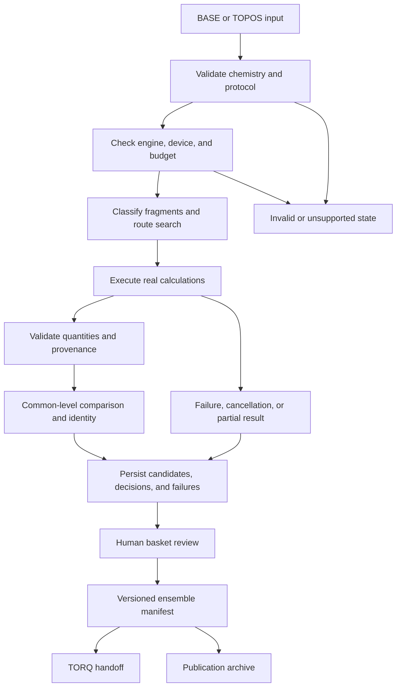

# CoChem-TOPOS Software Requirements Specification — 0.1.0

| Document control | Value |
|---|---|
| Document ID | `SRS-COCHEM-TOPOS-0.1.0` |
| Target software | **TOPOS 0.1.0** |
| Document revision | `0.1.0-draft.2` |
| Status | Revised requirements for review; not a software release or implementation certification |
| Review date | 2026-10-07, America/Chicago |
| Source baseline | `ce6cd25b8cd7a3b44e7dd7b0f54429d5c8a971cf` |
| Canonical location | `.docs/CoChem-TOPOS_SRS.md`; the root SRS is a navigation pointer |
| Companions | [Recommendations, risks, and conflicts](TOPOS_0.1.0_RECOMMENDATIONS.md); [references and evidence limits](TOPOS_0.1.0_REFERENCES.md) |

## 1. Purpose, scope, and interpretation

CoChem-TOPOS discovers, classifies, compares, and curates molecular conformers and non-covalent assemblies. CoChem-BASE supplies ingestion, the unified user experience, installation authority and bounded process execution; TOPOS supplies scientific workflow and result contracts; CoChem-TORQ receives a reviewed ensemble for downstream torsional, transition-state, or kinetic work. BASE, TOPOS and TORQ form one mandatory installation package. TOPOS UI/CLI entry points are adapters to these contracts and do not bypass BASE production authority. Installing TORQ does not certify completion of its downstream scientific implementation.

This revision preserves the original seven topics: ingestion, method selection, complex triage, jiggle–quench generation, deduplication, human review, and TORQ handoff. It separates requirements from speculative enhancements. All 108 earlier top-level proposals are accounted for in the recommendations. New engine internals, learned models, automatic active-space selection, and general kinetic networks are not silently promoted into 0.1.0 obligations.

**Versions are independent.** The package already declares `0.1.0`. CoChem ecosystem v4/v4.1/v4.2, SRS revision, method-matrix revision, data-schema version, engine version, and model checkpoint version have different meanings. Revising this document does not publish a release or validate prior implementation claims.

**Requirement language.** “Shall” describes intended behavior required by this draft, not verified existing functionality. A conditional capability must meet its requirements whenever exposed as supported. A proposal requires separate scientific and implementation assessment. Universal integrity requirements apply to every supported workflow. Unsupported capabilities may be unavailable; they may not be presented as completed calculations. Removing a promised capability requires an explicit scope decision.

The 0.1.0 acceptance target is a reproducible workflow from validated input through at least one real, declared search/refinement route to a reviewed ensemble and verifiable local export. The release must publish a supported chemistry and engine/version capability profile. Support for every element, charge, spin, periodic system, solvent, or tier label is not assumed.

## 2. Source authority and conflicts

| Source | Role and limits |
|---|---|
| [Method mapping](method_matrix.md), `COCHEM-SPEC-TASK2-4-4-METHOD-MATRIX-MAPPING-2026` | Convergence, frozen monomers, precision, spectroscopy, and resource priorities. Refers to Method Matrix v4.1 but is **not the complete purpose × time × hardware table**. |
| [Full method matrix](../wiki/Method_Matrix.md), Version 4, 9 August 2026, supplied in commit `6a01b0f2adb7cff02edda6e339facf3d6f93904d` | Purpose/time/hardware routes, concurrency, state reuse, composite methods, benchmarks and licensing discussion. Its v4 source identity is retained separately from mapping/profile v4.1 names; conflicts remain explicit in the catalog. Receipt of the document does not validate its examples, licensing interpretations or all route implementations. |
| [Historical baseline](../CoChem_TOPOS_Baseline_SRS.md), [Chunk 1](SRS_Chunk_Proposal_CoChem_TOPOS_Chunk_01_Architectural_Review.md), [Chunk 2](SRS_Chunk_Proposal_CoChem_TOPOS_Chunk_02_Architectural_Review.md), [Chunk 3](../TOPOS_Chunk_03_SRS.md) | Additional intent and conflicting choices. Some `REQ-TOPOS-*` IDs collide; named modules/line counts are not implementation evidence. |
| [RES-110 UI/xTB](COCHEM-COUNCIL-RES-110-8D-TASK-TOPOS-UI-XTB-SPOOF-RECTIFICATION-20260920.md), [Session 110 remediation](council/COUNCIL_RESOLUTION_SESSION_110_TOPOS_SPOOFING_REMEDIATION.md) | Truthful UI-to-engine execution, independent selectors, and rejection of fabricated output. These are different documents despite the shared number. |
| [RES-163 Codespaces/Actions](COCHEM-COUNCIL-RES-163-8D-PROB-TOPOS-UI-CODESPACES-ACTIONS-XTB-HE2-20260920.md), [RES-164 xTB/He2](COCHEM-COUNCIL-RES-164-8D-TOPOS-UI-XTB-HE2-SPOOF-RECTIFICATION-20260920.md) | Repository/dispatch identity, remote evidence, and honest missing-engine outcomes. |
| [RES-168 ORCA/HF-3c](audits/COCHEM-COUNCIL-RES-168-8D-TASK-7E41FA-TOPOS-ORCA-HF3C-SPOOF-RECTIFICATION-20260920.md), [RES-169 ORCA substitution](audits/COCHEM-COUNCIL-RES-169-8D-TOPOS-UI-ORCA-HF3C-DIFF-SUBSTITUTION-RECTIFICATION-20260920.md), [RES-169 xTB](audits/COCHEM-COUNCIL-RES-169-8D-TOPOS-UI-XTB-GFN2-HE2-SPOOF-RECTIFICATION-20260920.md) | Preserve requested engine/method and target repository. A real calculation using another method does not fulfill the request. |
| [RES-167 SRS persistence](COCHEM-COUNCIL-RES-167-8D-TASK-8912E0-TOPOS-SRS-PERSISTENCE-RECTIFICATION-20260920.md) | Complete physical document delivery and verifiable changes, not approval of an HDF5 redesign. Old hashes/test counts remain historical receipts. |
| [Reference register](TOPOS_0.1.0_REFERENCES.md) | Literature, official software/model sources, verified metadata, and retrieval limits. |

This draft uses `TOPOS-010-*` IDs. Legacy IDs must include their source document. Later dates, shared session numbers, `[M]` tags, and “ratified” headings do not establish scientific equivalence or resolve contradictions. Known conflicts remain explicit in §5 and the recommendations. This revision claims neither council ratification nor ISO/IEEE certification.

Imported provenance labels need evidence: `[M]` requires the measurement/reference and conditions; `[D]` needs assumptions and derivation; `[E]` needs an estimation/uncertainty basis; `[GOV]` denotes a project decision. These are not accuracy guarantees or substitutes for citations.

## 3. System boundaries and execution contract

| ID | Requirement | Acceptance evidence |
|---|---|---|
| **TOPOS-010-001** | Each run shall have unique identity, immutable input identity, capability profile, software/commit, matrix reference, schema version, and distinct attempt IDs. | Retries preserve parentage; exported results resolve to individual attempts. |
| **TOPOS-010-002** | Presentation environment, calculation environment, engine, method, basis/composite model, purpose, and budget shall be separate validated selections. | Codespaces + Actions + xTB + GFN2-xTB remains distinguishable from local execution; serialization preserves choices. |
| **TOPOS-010-003** | UI, CLI, and BASE adapters shall share typed request/result/status contracts. | Matching inputs produce matching semantic manifests; run-specific paths and dispatch IDs survive every adapter. |
| **TOPOS-010-004** | Unavailable requested capabilities shall return explicit unavailable/unsupported states. Another method may run only as an authorized alternative attempt, never as fulfillment of the original request. | Missing xTB cannot become EMT/LJ labeled GFN2-xTB; missing ORCA cannot become an HF-3c pass. |

Environment selectors are not six levels of chemical theory. Local, Codespaces/Actions, and HPC deployments need separate tested adapters. A label or API submission does not establish remote execution, completion, or credentials.

## 4. Scientific inputs and fragment triage

| ID | Requirement | Acceptance evidence |
|---|---|---|
| **TOPOS-010-005** | Declare atoms, coordinates/units, charge, multiplicity, atom mapping, fragments, and specified stereochemistry; isotope, environment, and constraints where relevant. | Reject nonfinite coordinates, inconsistent counts/spin parity, and unsupported states without neutral-singlet coercion. |
| **TOPOS-010-006** | Distinguish malformed, physically suspect, and unsupported input. Clash/bond rules shall be chemistry-aware and versioned. | Overlaps fail; valid short bonds/coordination are not rejected by an unexplained universal distance. |
| **TOPOS-010-007** | Query masses/radii through the governing dynamic provider and record its version/conventions. Select isotopes by mass number; never relabel atomic weights as isotope masses. | Isotopic inertia changes correctly; helium atomic weight is not emitted as exact He-4 mass. |
| **TOPOS-010-008** | Composition, protonation, electronic/spin state, stereochemistry, conformer identity, and sampling observations shall remain distinct. | Similar distances/energies cannot merge different states or enantiomers. |

Mendeleev supplies the specified mass/radius data, not every physical constant. Use a versioned constants provider and recorded CODATA edition. Scientific geometry/spectroscopy uses float64; ML-model precision is separately benchmarked. Configure JAX x64 before numerical arrays/compilation rather than relying on a literal source-line number. [S13](TOPOS_0.1.0_REFERENCES.md#s13)

**TOPOS-010-009.** Classify inputs as monomer, candidate weak complex, candidate strong/coordination complex, or unresolved. Distance/radius graphs are hypotheses. Preserve specified bonds and supported coordination; record rules and ambiguities. A metal alone does not prove an unbreakable entity or authorize cleavage. Ambiguous proton transfer, multicenter bonding, or coordination needs a supported rule or review.

**TOPOS-010-010.** Preserve the whole input, mapping, fragment states, and monomer-seed provenance when partitioning a weak complex. Perform monomer-first search when required by the protocol. A small-fragment sampling bypass needs a topology/degrees-of-freedom rationale; fewer than four atoms does not prove a unique structural/electronic state.

**TOPOS-010-011.** Rigid packing, flexible search, and frozen-monomer refinement shall state movable coordinates, confinement, clash handling, and deformation policy. ABCluster, ORCA GOAT, CREST, and internal jiggle–quench routines retain their actual algorithm identities.

**Independent starting states.** The student GUI, CLI and BASE entry point shall accept independently prepared inputs at every supported starting stage. This includes a single starting geometry for each calculation purpose, independently generated GOAT/CREST ensembles for common-level refinement, and the explicitly typed seed, ensemble and isolated-monomer inputs of matrix recipes. Users shall select the starting stage and frame membership rather than repeat an unrelated upstream search. Intake shall preserve the original files and hashes, source method/version and settings, units, atom mapping, molecular/fragment states and the user's attribution. Validate chemistry and stage compatibility before creating a canonical request. External source declarations and energy comments shall remain observations; they shall not mint a BASE-authorized execution attempt, waive stationarity or common-level requirements, or replace missing calculated quantities. Native checkpoints and computed-property imports require their own supported engine/state/geometry compatibility contracts. A verified saved CoChem run may instead use its existing recovery contract.

## 5. Method matrix, purpose, and hardware

### 5.1 Selection and route inventory

**TOPOS-010-012.** Bind each route to a versioned matrix row specifying purpose, chemical domain, engine/version, method, orbital/auxiliary basis or composite, dispersion, solvent, derivatives, convergence, resources, device, outputs, and alternatives. Validate combinations and archive engine inputs. Presets shall not silently change chemistry state, constraints, method, or reference state.

**TOPOS-010-013.** Define time budgets per geometry/ensemble/workflow, queue-time accounting, retries, and deadlines. Estimates need hardware/problem-size calibration and uncertainty. Budget exhaustion is partial/timed-out work, not convergence or exhaustive search. Time does not intrinsically define theory accuracy.

The mapping excerpt alone lacks the complete 11-tier matrix described by the original SRS. The full [Version 4 matrix](../wiki/Method_Matrix.md) is supplied. The current implementation preserves it in a source-hashed typed catalog, plans purpose/time/hardware routes and executes registered complete recipes. Catalog coverage and compiled-adapter coverage are separate: `cochem-topos matrix support` exposes the current inventory and route blockers. The historical [frontend](https://github.com/ProfJJK-CoChem/CoChem-TOPOS/blob/ce6cd25b8cd7a3b44e7dd7b0f54429d5c8a971cf/frontend/cochem_topos_ui.py) and [cascade](https://github.com/ProfJJK-CoChem/CoChem-TOPOS/blob/ce6cd25b8cd7a3b44e7dd7b0f54429d5c8a971cf/cascade_engine/cochem_topos_cascade_matrix.py) catalogues also differ. This table remains a **historical reconciliation inventory**, not a newly approved matrix or working-adapter declaration. Bind authoritative row identities and resolve conflicts before claiming full executable coverage; the current implementation record distinguishes supported recipes and remaining adapters.

| Recorded row(s) | Purpose and recorded method | Budget | Hardware/validation condition |
|---|---|---|---|
| T1-10s | Binding-topology prescreen; GFN2-xTB/XTB2 | 10 s | Identify CPU xTB/ORCA adapter; keywords and engine identity differ. |
| T1-1min | GOAT/GFN2-xTB; GFN-FF alternative | 1 min | CPU; actual GOAT and distinct alternative provenance. |
| T1-30min | MLFF exploration; AIMNet2 and legacy MACE-OFF24m | 30 min | GPU only with verified model/backend/device; CPU conditional; MACE artifact/API unresolved. |
| T1-1h | CREST NCI and union | 1 h | CPU; version-specific flags and applicable chemistry. |
| T1-3h | ORCA r²SCAN-3c/CREST union refinement | 3 h | CPU; authentic engine/composite evidence. |
| T1-12h; T1-1d; T1-3d | Cascade-only GOAT-r²SCAN-3c; GOAT-ENTROPY-XTB2; ωB97X-V/def2-TZVPP | 12 h; 1 d; 3 d | Absent from frontend; recorded CCSD(T)-F12 fallback changes method and requires separate authorization. |
| T2-1h | Relaxed 2D PES; ωB97X-V/def2-TZVPP | 1 h | CPU ORCA; scan constraints/domain and per-point vs total budget required. |
| T2-12h | Active-learning Δ-PES; DFT/PIP and CCSD(T)-F12 | 12 h | Experimental until fit/data/uncertainty/adapters are validated. |
| T3-1min | R1: frozen monomers + r²SCAN-3c | 1 min | CPU; validated reference geometry/rigidity; no universal completion guarantee. |
| T3-30min; T3-1h | Full ωB97X-V with def2-TZVPP or jun-cc-pVTZ | 30 min; 1 h | CPU; distinct basis/geometry protocols. |
| T3-3h | R2: frozen monomers + ωB97M-V/QZ; frontend appends CP/VPT2 | 3 h | Mapping specifies def2-QZVPP/DEFGRID3; CP/VPT2 scope needs reconciliation. |
| T3-12h | R4: junChS CBS+CV composite geometry | 12 h | Conditional ORCA/CFOUR; accuracy requires matching benchmark evidence. |
| T4-1min | Semi-experimental parent scaling | 1 min | Cited experimental input and separate validation data; not de novo. |
| T4-1h; T4-1d | DFT VPT2; production anharmonic corrections | 1 h; 1 d | Conditional ORCA/CFOUR; semi-rigid/resonance/large-amplitude limits explicit. |
| T3C-3d; T4C-1mo | CFOUR force fields/isotopologue campaign | 3 d; 1 mo | Conditional advanced capability; derivatives/resources benchmarked. |

The mapping's spend priority—geometry, vibrational rotational correction, frozen monomers, distortion/inertia, dipoles, quadrupoles, torsion/tunnelling, dissociation quantities—is project policy, not permission to replace a requested observable.

**TOPOS-010-014.** Select hardware after scientific applicability and backend verification. Record allocated cores/threads, RAM, GPU/VRAM, runtime, precision, elapsed/queue time. Bound workers × per-worker threads/memory. Do not transplant fixed P/E-core indices between machines. CPU execution of the same validated model may be allowed; replacing its Hamiltonian with xTB/LJ is a separate method decision. [S07](TOPOS_0.1.0_REFERENCES.md#s07)

### 5.2 Method definitions and applicability

**TOPOS-010-015.** Treat HF-3c/r²SCAN-3c as complete recipes, not arbitrary hybrid-DFT/basis combinations. The mapping’s r²SCAN-3c “mTZ2” description conflicts with the verified composite’s mTZVPP basis; use the validated engine-native recipe rather than an ad hoc replacement. HF-3c is not a hybrid functional; coupled-cluster approximations are not exact thermodynamics. “Basis not applicable” for xTB/MLFF is a schema/UI state, not an invented `--basis none` engine flag. GFN2-xTB and GFN-FF remain distinct. [S01](TOPOS_0.1.0_REFERENCES.md#s01), [S04](TOPOS_0.1.0_REFERENCES.md#s04)

**TOPOS-010-016.** Model metadata shall include artifact/hash, license, reference Hamiltonian, supported elements/charge/spin/system class, solvent, API, units, device/dtype. Out-of-domain use is unsupported or explicitly experimental. Verified MACE-OFF23 sources do not validate MACE-OFF24m imports; do not silently rename models. ALPB, CPCM, and SMD may describe the same solvent without being identical models. Solvent keywords and compatibility require validation against the selected engine version. [S01](TOPOS_0.1.0_REFERENCES.md#s01), [S07](TOPOS_0.1.0_REFERENCES.md#s07)

### 5.3 Numerical profiles and conflicts

The mapping specifies `TolE 1e-7 Eh`, `TolMaxG 1e-5 Eh/bohr`, `TolRMSG 3e-6 Eh/bohr`, `TolRMSD 5e-5 bohr`, `TolMaxD 1e-4 bohr`, `MaxIter 200`. Chunk 3 uses `TolE 1e-6`, `TolRmsG 5e-6`, `MaxIter 150`. Keep named conflicting profiles until resolved. Strict convergence does not prove chemical accuracy; 200 steps does not guarantee convergence.

**TOPOS-010-017.** Record the resolved convergence/grid profile and verify all criteria, including free-coordinate convergence under constraints. Ambiguity blocks production execution. Coarse-to-fine protocols must recompute/reconverge on the final grid. Syntax and derivative support require engine-version-specific validation.

For ORCA, request its documented `EnforceStrictConvergence` optimizer policy and retain the separate final-gradient check. A missing first-cycle energy-change row remains `NOT_EVALUATED` as a native printed diagnostic. The numerical energy-change condition may instead be established from an unambiguous pair of actual initial/final native energy evaluations for that single step, using the unchanged requested tolerance and a conservative bound for printed precision. Archive this as a separately identified computed condition, including source energies and output references; absence alone never passes a condition. The [native optimizer policy](TOPOS_ORCA_OPTIMIZER_POLICY.md) documents observed failures, the official manual and the execution/import validation contract.

**TOPOS-010-018.** Preserve the restriction against an initial full ab initio Hessian solely for routine optimization preconditioning. Use supported XTB2/Lindh/restart approximations. Later Hessians for minima classification, frequencies, thermochemistry, or a supported TS task have different purposes. A quasi-Newton approximation is not a frequency Hessian. Reject unsupported input rather than silently stripping it. Speedup claims require benchmarks.

### 5.4 Dimensional corrections

These correct arithmetic in the mapping without relaxing its thresholds. Values use the mapping's bohr conversion for internal comparison; executable constants need a recorded edition. [S13](TOPOS_0.1.0_REFERENCES.md#s13)

| Source statement | Correct result / limitation |
|---|---|
| `0.069 mdyn/Å = 0.069 N/m` | `1 mdyn/Å = 100 N/m`; therefore `6.9 N/m ≈ 0.004432 Eh/bohr²`. Intermediate value/numerator are off by 100; the reported final magnitude matches 6.9 N/m. The unnamed Fraser benchmark still needs a paper/system. |
| `1e-7 Eh ≈ 0.027 cm⁻¹` | Approximately `0.0219475 cm⁻¹`; an energy-change tolerance is not a frequency-accuracy guarantee. |
| `5e-5 bohr ≈ 0.026 pm` | `2.645886e-5 Å = 0.002645886 pm`. |
| `1e-4 bohr ≈ 0.053 pm` | `5.291772e-5 Å = 0.005291772 pm`. |
| `1e-6 Å = 1 fm` | `1e-6 Å = 0.1 fm`; a numerical rigidity tolerance is not molecular accuracy. |
| One rotational formula for Hz and cm⁻¹ | Frequency `Bν=h/(8π²I)`; wavenumber `B̃=Bν/c`, with consistent units for `c`. |
| Universal `δB/B=−2δR/R` | First-order relation for fixed-mass `I=μR²`; generally `δB/B=−δI/I`. Intrinsic inertia and coupled motion matter. |

The local harmonic estimate `ΔR≈g/k` assumes one-dimensional curvature; a Cartesian tolerance is not a universal structure-error bound. Unsupported accuracy/speedup/completion guarantees are withdrawn from this revised SRS. The historical mapping remains unchanged as a source record. Recommendations also record composite-basis, CP-sign, isotope, and constraint conflicts.

## 6. Search, refinement, and union

**TOPOS-010-019.** Archive initial structures, algorithm/potential, seeds, perturbations, constraints, windows/units, observations, and termination. Jiggle–quench does not guarantee every high-barrier basin. Search hits, unique conformers, and populations differ.

**TOPOS-010-020.** CREST/GOAT/ABCluster adapters shall retain actual commands/inputs, versions, logs, and ensembles. Resolve CREST option semantics: NCI confinement biases sampling; `--noreftopo` disables only initial topology checking; `--bthr 0.001` sets a lower bound for a dynamically adjusted rotational-constant threshold, not fixed identity proof. Another sampler on the same potential tests discovery robustness, not independent electronic accuracy. [S02](TOPOS_0.1.0_REFERENCES.md#s02), [S03](TOPOS_0.1.0_REFERENCES.md#s03)

**TOPOS-010-021.** Preserve seeds/source attribution, validate chemistry after optimization, use common-level comparisons, perform staged deduplication, and report incremental discovery (`INITIAL_SEED`, `GOAT_ONLY`, `CREST_ONLY`, `FOUND_BY_BOTH`, or named sources). Keep rejected candidates/reasons. Energy-window exclusion does not prove physical absence.

**TOPOS-010-022.** Rescue/restart shall create traceable attempts, check geometry/state/basis/version compatibility, and verify final requested method/convergence. Missing diagnostics are `NOT_EVALUATED`. T1/D1 thresholds are domain-dependent warnings, not universal multireference proof or active-space prescriptions. Automatic AutoCAS/method changes remain separate proposals.

### 6.1 Frozen monomers

**TOPOS-010-023.** Record monomer reference geometry/source/uncertainty, isotope/map/state, and constrained coordinates. Preserve internal distances while allowing intended relative motions. Validate constraint rank; distinguish global-frame redundancy from physical motion. Fixing one fragment's Cartesian coordinates does not preserve every mobile fragment's rigidity.

Two nonlinear rigid monomers have six relative degrees of freedom after global translation/rotation removal; linear/monatomic cases differ. Prevent unintended cross-fragment locks; intentional scans are separately recorded constraints. Mapping R1 is frozen-monomer r²SCAN-3c; R2 is ωB97M-V/def2-QZVPP with DEFGRID3. Preserve recipe identity.

**TOPOS-010-024.** Monitor intrafragment distance drift and free-subspace convergence. Mapping tolerance is `max|rij(t)−rij(0)| < 1e-6 Å`; Chunk 3 uses `1e-8 Å`. Resolve/record the profile and ensure output precision can resolve it. Frozen-coordinate residual forces may be nonzero; retain their units/projection/strain separately. Constrained stationary points are not automatically full-dimensional minima.

## 7. Deduplication, chirality, and spectroscopy

| ID | Requirement | Acceptance evidence |
|---|---|---|
| **TOPOS-010-025** | Hashes, bounding boxes, Coulomb descriptors, and rotational constants shall screen comparisons, not prove identity; identifiers need collision handling. | Collisions/homometric cases survive; histogram differences are not coordinate RMSD. |
| **TOPOS-010-026** | Final comparisons shall specify atom mapping/selection, proper rotations, permutation/symmetry, weighting, units, and thresholds. | Transform/permutation invariance; enantiomer/diastereomer separation; explicit linear/single-atom handling. |
| **TOPOS-010-027** | Point groups shall record geometry/isotope convention, algorithm/version, tolerance, uncertainty. Near-symmetry differences trigger comparison/review. | Small perturbations do not invent species; equal inertia eigenvalues do not imply C2v. |
| **TOPOS-010-028** | Enantiomer relations/degeneracy shall be explicit; reflection is not chirality-preserving rotation; do not universally assign `g=2`. | Respect achirality, isotopes, chiral environments, both sampled members, and partition-function convention. |

Symmetry-aware RMSD still needs chemical policy. Point group, connectivity, and rotational spectrum differ. Fixed per-element dispersion-inspired weights are heuristic descriptors, not computed D4. [S04](TOPOS_0.1.0_REFERENCES.md#s04), [S05](TOPOS_0.1.0_REFERENCES.md#s05)

**TOPOS-010-029.** Distinguish equilibrium `Ae,Be,Ce` from averaged `A0,B0,C0`; record units, isotopes, geometry level, correction model, uncertainty. The semi-rigid expression `B0=Be−½Σr αrB` has different mode/validity assumptions for linear, constrained, and large-amplitude systems. Uncorrected `Be` is not experimental `B0`; empirical scaling needs independent validation.

VPT2/DVR, tunnelling, distortion, and SPCAT are conditional advanced capabilities. A heading or absent module's line count does not prove implementation. TORQ handoff certifies neither a saddle/rate nor exhaustive search.

## 8. Quantities, corrections, and thermodynamics

**TOPOS-010-030.** Every quantity shall include value/units, definition, geometry/attempt, method/parser, and validity/convergence. Retain raw output; normalize once. Proposed exchange convention: coordinates Å, energy Eh, gradient Eh/bohr, Hessian Eh/bohr². Other internal conventions need boundary conversion.

Let `q=a0/Å` and `u=Eh/eV`. For a calculator obeying ASE's conventional eV/Å contract:

\[
E_{Eh}=E_{eV}/u,\qquad g_{Eh/a_0}=-F_{eV/\mathring A}\,q/u,\qquad H_{Eh/a_0^2}=H_{eV/\mathring A^2}\,q^2/u.
\]

Check the actual calculator contract. `∇E=−F` provides a sign, not a conversion.

**TOPOS-010-031.** Validate finite values, atom order, `N×3` gradients, `3N×3N` Cartesian Hessians, symmetry tolerance, and derivative consistency. Missing is not zero. Zero gradients can be physical; detect fabrication through provenance/numerical checks, not a nonzero rule. Label projected/constrained quantities separately.

**TOPOS-010-032.** Compare compatible stoichiometry, state, environment, reference, and method protocols. Distinguish interaction energy from binding including fragment deformation. Association requires balanced stoichiometry and standard-state/reservoir treatment. Each conformer's highest tier is not necessarily a common energy scale.

**TOPOS-010-033.** Specify whole-method BSSE policy, fragments/states, observable, and sign. For two fragments at complex geometry:

\[
E_{int}^{CP}=E_{AB}^{AB}-E_A^{AB}-E_B^{AB}.
\]

Ghost-basis fragment calculations need explicit states. A conventional additive correction to uncorrected interaction energy is `(EA^A−EA^AB)+(EB^B−EB^AB)`, not its opposite labeled nonnegative. Variational monotonicity is not universal for approximate correlated methods. Composite gCP differs from fragment CP; avoid undocumented double correction. Finite quadruple-zeta bases are not automatically BSSE-free. [S04](TOPOS_0.1.0_REFERENCES.md#s04)

**TOPOS-010-034.** Separate electronic energy, ZPE, thermal enthalpy, entropy, solvation, standard-state correction, and Gibbs energy. A justified mixed-level construction is `G=Ehigh+(Glow−Elow)`, not `Ehigh+Glow`. Record scaling, imaginary-mode policy, quasi-RRHO/rotors, uncertainty. For frozen/constrained geometries, declare the Hessian subspace, constraints, and thermal model; do not automatically apply whole-molecule RRHO. Distinguish excluded rigid motions and numerical near-zero modes from genuine unstable modes. A full-dimensional minimum claim requires the appropriate stationary-point/mode validation; a constrained minimum establishes stability only in its allowed subspace. Electronic-energy weights are not full thermodynamic populations. [S06](TOPOS_0.1.0_REFERENCES.md#s06)

For comparable states and a declared degeneracy convention:

\[
p_i=\frac{g_i e^{-(G_i-G_{min})/(RT)}}{\sum_j g_j e^{-(G_j-G_{min})/(RT)}},\qquad G_{ens}=G_{min}-RT\ln\sum_i g_i e^{-(G_i-G_{min})/(RT)}.
\]

**TOPOS-010-035.** Normalize stably, state energy/`R` units, and count degeneracy/configurational mixing once. Search-hit counts are not equilibrium probabilities. Report missing-conformer/sampling sensitivity; flat discovery curves do not alone certify completeness.

**TOPOS-010-036.** Preserve structural identity independently of kinetics. NEB potential maxima are not automatically free-energy barriers or verified saddles. Barrier `<kBT` alone shall not delete/merge conformers. Kinetic grouping needs timescale, temperature, model, uncertainty, reversible links. Simple unimolecular TST uses `k=κ(kBT/h)exp(−ΔG‡/RT)` under its assumptions; detailed kinetics needs a validated TOPOS/TORQ contract. [S12](TOPOS_0.1.0_REFERENCES.md#s12)

## 9. Persistence and recovery

**TOPOS-010-037.** Version the logical schema linking runs, inputs, fragments, conformers, attempts, artifacts, quantities, decisions, exports. `/deduplicated_isomers/` remains interchange intent, not proof that readers/writers agree. Preserve originals/rejection reasons. Resume requires matching input/protocol and validated completed attempts.

| Record | Minimum content |
|---|---|
| Run | IDs/parentage, software/commit/dirty state, matrix/profile/schema, timestamps, requested purpose/method, resources/state. |
| Molecule | Input digest, atoms/isotopes/map, coordinates/units, state/stereochemistry, fragments/environment/constraints. |
| Attempt | Requested/executed engine/method, inputs/arguments, versions/model digest, seed, artifact membership, termination. |
| Quantity | Property/units/value or absence, geometry/source, convergence, uncertainty, corrections/parser/conversion. |
| Decision | Compared IDs, metric/threshold/protocol, actor/reason/time, superseded decision. |
| Ensemble/export | Members/comparison/weights, review/completeness, digests/citations/licenses/access. |

**TOPOS-010-038.** Define writer ownership/filesystem semantics. Locks and `libver='latest'` do not activate SWMR. Genuine SWMR needs supported versions/layout, precreated objects, writer activation/flush, reader refresh; it is not arbitrary multi-writer access. Use a tested single-writer/snapshot design or separately validated SWMR. Memmaps are caches, not instant durable recovery guarantees. [S08](TOPOS_0.1.0_REFERENCES.md#s08)

**TOPOS-010-039.** Define result commit boundaries and verify membership. Test interrupted writes, corruption, full disk, duplicate attempts, restart, independent concurrent runs. Readable HDF5 does not prove a complete scientific transaction. Quotas need controlled failure/backpressure, not deletion of required evidence.

Use configured paths/per-run scratch outside source directories. Checksums establish byte integrity; cross-device agreement needs scientific tolerances, not unqualified bitwise guarantees.

## 10. Execution state and host protection

**TOPOS-010-040.** Separate execution states (queued/running/completed/partial/timed-out/cancelled/failed/unavailable/unsupported) from validation (not-evaluated/rejected/validated-for-protocol/human-review). Show actual method/limitations. Exit zero or an open server port is not scientific success.

**TOPOS-010-041.** Retain actual environment, resource/job identity, timing, retrieval, cancellation. Actions submission is not completion; local tests are not remote evidence. UTF-8-safe streaming preserves logs/exit status without UI crashes. Exclude credentials from logs/bundles.

**TOPOS-010-042.** Enforce finite budgets, bounded retries, isolation, and cleanup of owned process trees. Apply Windows Job Objects/window suppression where supported and POSIX process groups on POSIX. Cancellation preserves completed evidence. Solver retries need recorded scientifically compatible rules.

Explain unavailable capabilities in actionable user terms. Internal implementation labels are not chemical choices. Council receipts remain task/revision-specific; a passing defect-detection test is not successful scientific execution.

## 11. Human review and TORQ handoff

**TOPOS-010-043.** Baskets expose structures, provenance, metrics, consistency, unresolved chemistry. Overrides retain original decision, actor/reason/scope. Manual symmetry/grouping is annotation, not raw-data rewriting. One branch may await review while independent work continues; silence is not approval.

The student interface shall provide a structure view, validated file-intake preview, explicit selection of available matrix purpose/time/device routes, saved-run recovery, and browser retrieval of verified exports. Unavailable hardware or a source-defined missing protocol shall have an actionable explanation. BASE shall open the complete installed TOPOS interface through the reviewed mandatory package; an installation button or a generic JSON panel alone does not demonstrate this student workflow.

**TOPOS-010-044.** Handoff includes versioned member/geometry IDs, maps/states/protocols/constraints, review/uncertainty, digests. TORQ acknowledges the exact manifest/schema. Reject incompatible/incomplete handoffs; changes create a new ensemble version. Search provenance does not guarantee TORQ never needs more sampling.

## 12. Publication and academic rigor

**TOPOS-010-045.** Generate methods/tables/SI from eligible executed records. Missing/unconverged values stay absent with reasons: never fill energy with `0.0 Eh` or generic accuracy claims. Terminal selection follows scientific eligibility, not group-name sorting.

**TOPOS-010-046.** Export a complete path/size/digest inventory, inputs/raw outputs/parsers, selected/failed/excluded structures/reasons, units, software/models/environment, seeds/settings, matrix/profile, licenses/citations, and table/figure recipes. Membership follows run identity, not directory globs. ZIP/checksum creation alone is not FAIR compliance.

**TOPOS-010-047.** Cite actual software, numerical methods, basis/parameters/models, reference data, and observables. Distinguish peer review, preprints, documentation, policy, unverified manuscripts. Preserve software credit separately from preferred papers. CFF and optional validated RO-Crate/CodeMeta support discovery, not chemical validation. [S09](TOPOS_0.1.0_REFERENCES.md#s09), [S10](TOPOS_0.1.0_REFERENCES.md#s10)

**TOPOS-010-048.** Separate export, draft deposit, and public release. Reserved DOI is not published evidence. Record exact-version/all-versions identifiers distinctly; cite the exact reproduction version. Publication needs explicit author action and verified licenses/access. This edit performs none of these actions. [S11](TOPOS_0.1.0_REFERENCES.md#s11)

Flow: validate → freeze manifest → regenerate methods/tables → verify archive → author review → deposit/publish → verify archived version. Match benchmarks to chemistry claims, disclose exclusions/negative results, separate fitting from validation, and avoid threshold tuning on the final test set.

## 13. Verification and acceptance

**TOPOS-010-049.** Distinguish deterministic algorithms, authentic parser fixtures, real-engine integration, end-to-end dispatch, and scientific references. Generated/test-double values cannot represent real chemistry. Council no-spoof/no-skip gates need exact engine/environment evidence; unavailable dependencies leave capabilities unverified.

**TOPOS-010-050.** Record tested revision/configuration, targets/counts, logs/results, tolerances, unavailable/excluded checks, references/hardware/limitations. Old receipts, static checks, and absent modules cannot replace current evidence. Document delivery requires saved files and a reviewable diff—the applicable RES-167 lesson.

| Case | Requirement suffixes | Pass condition |
|---|---|---|
| A01 input | 005–011 | States/isotopes propagate; invalid/unsupported inputs fail without coercion; fragments traceable. |
| A02 selection | 001–004, 012, 015–016 | Actual method/environment matches request or explicit alternative; no substitute missing-engine pass. |
| A03 quantities | 007, 030–031 | Authentic/analytical quantities convert; derivatives agree within declared tolerance; zero differs from absence. |
| A04 constraints | 017–018, 023–024 | Resolved profile, free-coordinate convergence, adequate precision, rigidity, residual-force diagnostics. |
| A05 identity | 008, 019–021, 025–028 | Transform/permutation invariance; chirality/collisions preserved; attribution/rejections retained. |
| A06 thermodynamics | 029, 032–036 | Incompatible protocols rejected; equal-Gibbs-energy/equal-degeneracy states have equal populations; common shifts/duplicate hits do not change weights. |
| A07 recovery | 037–039 | Interrupted/corrupt/full-disk/duplicate/restart cases explicit; committed records survive, incomplete records unpromoted. |
| A08 dispatch | 002–004, 013–014, 040–042 | Actual job evidence, bounded resources, intact streams, owned-worker cancellation, honest partial/failure. |
| A09 review | 043–044 | Auditable overrides and exact-version acknowledgment; stale/incompatible handoffs rejected. |
| A10 publication | 045–048 | Verified membership/digests; tables regenerate; missing data/unpublished identifiers remain labeled. |
| A11 science | 019–036, 049–050 | Named domain references meet predeclared tolerances with matched observables/states/conditions and disclosed limitations. |
| A12 documents | 001, 012, 050 | Unique IDs, source links, qualified legacy mapping, saved deliverables, no fabricated approval/release. |

Suffixes refer to `TOPOS-010-`. Scientific limits come from resolved profiles/domain benchmarks, not universal arbitrary values. Water/formic-acid dimers and a chiral organic case are candidate fixtures. He2 can test dispatch honesty; alone it cannot validate xTB/DFT accuracy or experimental binding. Potential minima, quantum-averaged separations, and thermal means are different observables.

Reference campaign plans shall be frozen before the measured calculations, retaining cited data bytes and hashes, independently selected tolerances and their rationale, reference uncertainties or their explicit absence, chemical domain, charge/spin/isotopes, geometry role, observable definition, units, reference protocol and conditions. The calculated method and the reference method remain separately identified when assessing an approximation against a higher-level benchmark. Repeating a prior native calculation is a reproducibility calibration; it does not establish independent scientific accuracy. A comparison report shall reverify the immutable calculation history and the actual source/derivative evidence rather than accept top-level pass flags. The versioned [S66/S22 reference review](TOPOS_0.1.0_REFERENCES.md#s14) identifies available fixed-geometry electronic points and their limits; it supplies neither universal tolerances nor completed acceptance.

Reviewed-matrix campaign acceptance shall require a completed authentic full-row RunStore for each available TOPOS row, bound to its predeclared input, reviewed protocol and current source. Partial compatibility branches and compiled recipes cannot substitute for those calculations. The inventory shall retain the two source-defined unavailable CFOUR time tiers and exclude the 96 TORQ-owned rows explicitly. This campaign establishes execution coverage for its declared cases; it does not establish exhaustive sampling, universal chemical-domain accuracy or completion of TORQ.

## 14. Legacy traceability and implementation tasks

| Original chapter | Revised coverage |
|---|---|
| 1 BASE/GUI/HDF5 | §§3–4, 9–10; 001–011, 037–042 |
| 2 method matrix | §5; 012–018, route/conflict inventory |
| 3 triage/frozen monomers | §§4, 6; 009–011, 023–024 |
| 4 generation | §6; 019–022 |
| 5 deduplication | §§7–8; 025–036 |
| 6 human sorting | §11; 043 |
| 7 TORQ | §11; 044; no unsupported completeness claim |

| Historical baseline IDs (`CoChem_TOPOS_Baseline_SRS.md`) | New IDs / disposition |
|---|---|
| REQ-TOPOS-001–003 | 005–010; chemistry-aware validation and justified bypass. |
| REQ-TOPOS-004–008 | 011, 019–021; algorithm identity, common-level union, attribution. |
| REQ-TOPOS-009–011 | 025–028, 037–039; screening vs identity, cache vs durability. |
| REQ-TOPOS-012–016 | 017–018, 022–024; named profile conflicts and traceable rescue. |
| REQ-TOPOS-017 | 022; diagnostics retained; automatic active spaces separately proposed. |
| REQ-TOPOS-018–020 | 006, 037–042; domain-aware watchdog, isolation, ownership/schema. |
| REQ-TOPOS-021–024 | 029, 044; DVR/spectroscopy conditional with separate validation. |
| REQ-TOPOS-025–027 | 012–016, 030, 040–042; capability checks replace fixed host indices. |
| REQ-TOPOS-028 | 004, 015; real LJ does not fulfill another requested method. |
| REQ-TOPOS-029–030 | 003, 040–041, 049–050; static checks supplement execution. |
| NFR-TOPOS-01–07 | 013–014, 030–031, 037–042, 049–050; OS scope, precision, budgets, actual SWMR/evidence. |

Source-qualified chunk/council requirements, all earlier proposals, and decisions needing review are in [the recommendations](TOPOS_0.1.0_RECOMMENDATIONS.md). Historical files retain their own IDs; no global renumbering is performed. The method mapping’s VR-02/VR-04 and QS-1/QS-3 remain source-qualified references to its verification/precision intent, not assertions that the external CoChem-BASE tests ran here.

### Implementation Tasks

These are traceability tasks, not an assertion that every task remains unstarted. Current implemented code and its conditional/external evidence are recorded in the [implementation record](TOPOS_0.1.0_IMPLEMENTATION.md) and [completion checklist](TOPOS_COMPLETION_CHECKLIST.md). A registered route that requires unavailable licensed infrastructure remains conditional; a matrix row without a complete recipe remains explicitly unsupported.

- **Task 1.1:** Resolve complete matrix revision, route conflicts, chemistry/engine capabilities, and numerical profiles before release coverage claims.
- **Task 1.2:** Validate shared requests/results/provenance, identity, and unit contracts (001–018, 030–033).
- **Task 2.1:** Connect UI/CLI/remote routes to real engines and truthful unavailable/failure/partial states (002–004, 040–042).
- **Task 2.2:** Validate search, union, identity, frozen monomers using authentic engine evidence (019–029).
- **Task 3.1:** Reconcile persistence readers/writers, ownership, commit/recovery, round trips (037–039).
- **Task 3.2:** Implement auditable review/versioned TORQ handoff (043–044).
- **Task 4.1:** Implement eligible export/citations/manifests/reproducible tables; assess optional deposition separately (045–048).
- **Task 4.2:** Retain A01–A12 evidence for the exact release profile; publish limitations/deferred extensions (049–050).

Implementation and verification against these tasks are recorded in the [chapter-by-chapter implementation record](TOPOS_0.1.0_IMPLEMENTATION.md). That record distinguishes tested capabilities, conditional adapters and unresolved requirements. This requirements document itself does not certify passing application tests, scientific accuracy, a software release or published results.
