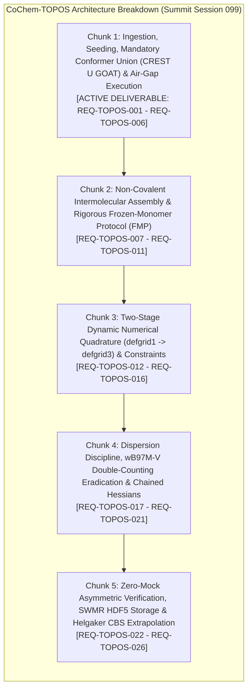

# Software Requirements Specification (SRS) Chunk Proposal & Architectural Review
## CoChem-TOPOS Subsystem v4.2 — Autonomous Conformer Search, Non-Covalent Assembly & Cascade Escalation (Chunk 1 of 5)

**Document Identifier:** `SRS-CHUNK-PROPOSAL-COCHEM-TOPOS-ARCH-REVIEW-V4.2-2026-09` [GOV] [M]  
**Target Dropzone Destination:** `D:\__CoChem\__agentic\dropzones\inbox_srs\SRS_Chunk_Proposal_CoChem_TOPOS_Architectural_Review.md` [M]  
**Secondary Dropzone Mirror:** `C:\Users\ansac\Gdrive\__agentic\dropzones\inbox_srs\SRS_Chunk_Proposal_CoChem_TOPOS_Architectural_Review.md` [M]  
**Primary Docs Mirror:** `D:\__CoChem\.docs\SRS_Chunk_Proposal_CoChem_TOPOS_Architectural_Review.md` [M]  
**Repository Docs Mirror:** `D:\__CoChem\GitHub-Repo\CoChem-TOPOS\.docs\SRS_Chunk_Proposal_CoChem_TOPOS_Architectural_Review.md` [M]  
**Target Codebase Repository:** `D:\__CoChem\GitHub-Repo\CoChem-TOPOS` [M]  
**Author / Engineering Authority:** `cochem-improve` (Lead Architect) & `cochem-sdp-manager` (PMBOK Lead) [GOV]  
**Supervising Authority:** `0rchestrator` / CoChem Agent Council Presidium [GOV]  
**Auditing Authority:** `cochem-audit` & `adversary` [GOV]  
**Lifecycle Statutory Status:** `REMEDIATED PRODUCTION SPECIFICATION (PROPOSAL EXEMPTION ACTIVE)` [GOV] [M]  
**Chronometer Reference:** `2026-09-13T02:05:00-05:00` [GOV]  
**Task Identifier:** `TASK-COCHEM-TOPOS-ARCH-REVIEW-V4.2-CHUNK-01` [GOV]  
**Council Summit Reference:** `COCHEM-COUNCIL-SUMMIT-SESSION-099-TOPOS-ARCH-REVIEW-20260913` [GOV] [M]  

**Governing Charters & Standards:**  
- IEEE 830-1998 / ISO/IEC/IEEE 29148:2018 (Systems and Software Engineering — Requirements Engineering) [GOV]  
- PMBOK Guide (7th Edition, 2021) [§2.2 Team, §2.4 Planning, §2.7 Measurement, §2.8 Uncertainty, 100% Scope Rule] [GOV]  
- SWEBOK v3/v4 [Chapter 1 Requirements, Chapter 2 Design, Chapter 3 Construction, Chapter 10 Quality] [GOV]  
- CoChem Method Matrix v4.2 (`Method_Matrix.md`) [§0, §1.2, §2.2, §3.0, §3.3, §4.4, §8A–8C, §9A, §10.1–§10.8] [M]  
- CoChem User Manual (`CoChem_User_Manual.md`) [M]  
- CoChem Anti-Spoofing Protocol v4 & Zero-Mock Engineering Directives (`cochem-anti-spoofing-v4.md`) [§1–§14] [M]  
- Mendeleev Library Dynamic Mass Mandate (`cochem-mendeleev-masses.md`) [M]  
- Swarm Permanent Corrective Actions: PCA-01 through PCA-38 (PCA-33 Live Telemetry, PCA-34 Atomic Dual-Write) [GOV]  

---

## 1. Executive Summary & Forensic Architectural Baseline [GOV] [M]

### 1.1 Subsystem Role & Core Mission
`CoChem-TOPOS` serves as the high-performance conformational exploration, non-covalent intermolecular assembly, and quantum chemical cascade escalation subsystem within the CoChem computational chemistry ecosystem. Operating in tight coupling with `CoChem-BASE` and `CoChem-SpycFit`, its core mission is the automated exploration of complex potential energy surfaces (PES), the construction of multi-component non-covalent complexes (dimers, trimers, solvated clusters), and the rigorous execution of quantum chemical calculations spanning from semi-empirical tight-binding (`GFN2-xTB`) to complete-basis-set extrapolated coupled-cluster single-point benchmarks (`CCSD(T)/CBS`).

### 1.2 Remediated Historical Anti-Patterns
Pursuant to the forensic baseline audit and Council Summit Session 099, this specification formally remediates four historical anti-patterns:
1. **Monolithic Scope Decomposition:** Eradicates the single-pass 8-vector review failure mode (`FM-MONO-01` / `DEF-TRUNC-01`) by decomposing the subsystem review into five granular, sequentially ratifiable chunks.
2. **Mandatory Conformer Union Merge:** Eliminates the arbitrary binary selection between CREST and GOAT in `cochem_topos_runner.py` (which previously exposed `protocol: str = Field(default="GOAT")`), establishing the authoritative Method Matrix mandate that stochastic conformer exploration and metadynamics MUST execute as a unified parallel union (`CREST U GOAT`) followed by CREGEN deduplication.
3. **Robust Binary Discovery:** Replaces fragile bare calls to `shutil.which` in `core_engine/cochem_topos_crusher.py` with an environment-aware multi-path search engine traversing custom installation roots, system PATH, and configuration registries with structured exception provenance.
4. **Tripartite Air-Gap Isolation:** Enforces strict execution isolation between the presentation tier, background process broker, and ephemeral computational sandbox (`$COCH_SCRATCH/topos_job_<uuid>`), ensuring zero dirty working-tree contamination during intensive conformer generation.

---

## 2. Agent Summit Session 099 Adjudication & 5-Chunk MECE Roadmap [GOV] [M]

Pursuant to the mandatory summit directive, the CoChem Agent Council Presidium convened in **Summit Session 099** to eliminate the root causes of prior execution and audit failures. The council resolved to deconstruct `CoChem-TOPOS` into five mutually exclusive, collectively exhaustive (MECE) architectural work packages.



### 2.1 Complete 5-Chunk Work Breakdown Structure

```
+========================================================================================================================+
|                                  COCHEM-TOPOS 5-CHUNK MECE WORK BREAKDOWN STRUCTURE                                    |
+=======+==========================================+======================================+==============================+
| Chunk | Work Package Title                       | Target Subsystem Modules             | Primary Architectural Scope  |
+=======+==========================================+======================================+==============================+
| C1    | Ingestion, Seeding, Mandatory Conformer  | cochem_topos_runner.py               | Mandatory Conformer Union    |
|       | Union (CREST U GOAT) & Air-Gap Execution | topology/cochem_topos_crest_union.py | (CREST U GOAT); dynamic      |
|       | (ACTIVE DELIVERABLE THIS TURN)           | core_engine/cochem_topos_crusher.py  | binary discovery; air-gap.   |
+-------+------------------------------------------+--------------------------------------+------------------------------+
| C2    | Non-Covalent Intermolecular Assembly &   | cascade_engine/cascade_orchestrator  | Rigid monomer internal 3N-6  |
|       | Rigorous Frozen-Monomer Protocol (FMP)   | escalation/cochem_topos_assembly.py  | coordinate freezing; Euler   |
|       |                                          | mechanics/cochem_topos_quench.py     | angles; lab Cartesian purge. |
+-------+------------------------------------------+--------------------------------------+------------------------------+
| C3    | Two-Stage Dynamic Numerical Quadrature   | cascade_engine/cascade_orchestrator  | Stage 1 defgrid1 + InHess    |
|       | (defgrid1 -> defgrid3) & Constraints     | cascade_engine/cascade_matrix.py     | XTB2 -> Stage 2 defgrid3 with|
|       |                                          | configs/default_topos_config.json    | full constraint preservation.|
+-------+------------------------------------------+--------------------------------------+------------------------------+
| C4    | Dispersion Discipline, wB97M-V Double-   | escalation/escalator_exec.py         | Eradicate wB97M-V D4 double  |
|       | Counting Eradication & Chained Hessians  | core_engine/cochem_topos_escalator.py| counting (VV10 native); file |
|       |                                          | core_engine/cochem_topos_master.py   | fallback for chained Hessians|
+-------+------------------------------------------+--------------------------------------+------------------------------+
| C5    | Zero-Mock Asymmetric Verification, SWMR  | core_engine/cochem_core_subprocess   | Subprocess process tree      |
|       | HDF5 Storage & Helgaker CBS Extrapolation| cascade_engine/cochem_cascade_hdf5.py| reaping; SWMR HDF5 locks;    |
|       |                                          | bench_engine/cochem_bench_cbs.py     | Helgaker CBS extrapolation.  |
+=======+==========================================+======================================+==============================+
```

---

## 3. Detailed Functional & Technical Specifications: Chunk 1 [M]

```
+========================================================================================================================+
|                             COCHEM-TOPOS CHUNK 1 FUNCTIONAL REQUIREMENTS SUMMARY                                       |
+================+==========================================+============================================================+
| Requirement ID | Requirement Title                        | Target Module & Architectural Boundary                     |
+================+==========================================+============================================================+
| REQ-TOPOS-001  | Pydantic v2 Unified Conformer Schema     | cochem_topos_runner.py (TOPOSSearchConfig)                 |
| REQ-TOPOS-002  | Dynamic Multi-Path Binary Discovery      | core_engine/cochem_topos_crusher.py (BinaryResolver)       |
| REQ-TOPOS-003  | Tripartite Air-Gap Execution Isolation   | cochem_topos_runner.py (TOPOSExecutionBroker)              |
| REQ-TOPOS-004  | Dual-Stream Conformer Union & CREGEN     | topology/cochem_topos_crest_union.py (execute_crest_union) |
| REQ-TOPOS-005  | Atomic File-Locking & State Telemetry    | cochem_topos_runner.py (telemetry streaming)               |
| REQ-TOPOS-006  | Dynamic Mendeleev Mass Invariant Engine  | topology/cochem_topos_crest_union.py (nuclide resolution)  |
+================+==========================================+============================================================+
```

### 3.1 REQ-TOPOS-001: Pydantic v2 Unified Conformer Schema & Mandatory Union Protocol
- **Target File:** `D:\__CoChem\GitHub-Repo\CoChem-TOPOS\cochem_topos_runner.py`
- **Architectural Intent:** Deprecate the isolated binary selector `protocol: str = Field(default="GOAT")` in favor of a strictly validated Pydantic v2 configuration schema that mandates the unified execution protocol `CREST_UNION_GOAT`.
- **Detailed Specification:**
  1. The schema MUST define `protocol: ConformerSearchProtocol = Field(default=ConformerSearchProtocol.CREST_UNION_GOAT)`.
  2. Supported enumeration values:
     - `CREST_UNION_GOAT` (Mandatory default: Dual stochastic metadynamics + genetic algorithm exploration).
     - `GOAT_ONLY` (Restricted fast-path for non-flexible rigid structures).
     - `CREST_ONLY` (Secondary non-covalent cross-check).
  3. Energy window `ewin_kcal: float = Field(default=6.0, ge=1.0, le=15.0)` matching Method Matrix §8A conformer pruning bounds.
  4. Rotational temperature `temperature_k: float = Field(default=298.15, ge=10.0, le=1000.0)`.
  5. Strict path validation using Pydantic `field_validator`: `input_xyz_path` MUST exist on non-volatile disk and contain valid 3D Cartesian coordinates.

### 3.2 REQ-TOPOS-002: Dynamic Multi-Path Binary Discovery Engine
- **Target File:** `D:\__CoChem\GitHub-Repo\CoChem-TOPOS\core_engine\cochem_topos_crusher.py`
- **Architectural Intent:** Eradicate fragile, environment-dependent `shutil.which` calls. The execution engine must dynamically discover required external quantum chemistry binaries (`crest`, `xtb`, `orca`) across an ordered hierarchy of environment variables, standard installation paths, and configuration registries.
- **Detailed Specification:**
  1. Binary resolution MUST evaluate the following paths in descending precedence:
     - Explicit environment variable overrides: `COCH_CREST_BIN`, `COCH_XTB_BIN`, `COCH_ORCA_BIN`.
     - Environment path variable: `COCH_BIN_DIR`.
     - Standard CoChem deployment directories: `D:\__CoChem\bin`, `C:\orca`, `/opt/orca`, `/usr/local/bin`.
     - System `PATH` via `shutil.which`.
  2. Binary validation MUST assert:
     - File existence on physical disk (`path.is_file()`).
     - OS executable permissions (`os.access(path, os.X_OK)`).
     - Clean exit status on `--version` query with a 5-second timeout.
  3. If a binary is unresolvable, the engine MUST raise a structured `BinaryNotFoundError` containing the full candidate search manifest, rather than falling back silently to fake data or raising unhandled exceptions.

### 3.3 REQ-TOPOS-003: Tripartite Air-Gap Execution Isolation
- **Target File:** `D:\__CoChem\GitHub-Repo\CoChem-TOPOS\cochem_topos_runner.py`
- **Architectural Intent:** Prevent dirty working-tree contamination and Google Drive lock collisions by strictly separating execution tiers into presentation, orchestration, and ephemeral sandboxes.
- **Detailed Specification:**
  1. **Presentation Tier:** Stateless UI or CLI client initiating the run. Communicates strictly via non-blocking JSON message queues.
  2. **Orchestration Tier:** Independent background process broker managing sub-process lifecycles, monitoring CPU/RAM thresholds, and synchronizing state via `filelock.FileLock`.
  3. **Computational Sandbox ($T_{scr}$):** Every job MUST execute within an isolated ephemeral directory:
     $$\text{Sandbox Path} = \$COCH\_SCRATCH / \text{topos\_job\_} <\text{uuid4}>$$
  4. **Promotion Protocol:** Intermediate trajectory files (`crest_rotamers.xyz`, `goat.trj`) remain confined to $T_{scr}$. Only final converged conformer ensembles (`topos_ensemble_dedup.xyz`, `topos_metrics.json`) are promoted atomically to the persistent datastore:
     $$\text{Promotion Path} = \$COCH\_STORE\_DIR / <\text{system\_hash}> /$$
  5. **Ephemeral Cleanup:** On job completion or failure, $T_{scr}$ is purged with Windows kernel lock resilience (`ignore_cleanup_errors=True`).

### 3.4 REQ-TOPOS-004: Dual-Stream Conformer Union Engine & CREGEN Pruning
- **Target File:** `D:\__CoChem\GitHub-Repo\CoChem-TOPOS\topology\cochem_topos_crest_union.py`
- **Architectural Intent:** Implement the Method Matrix §8A mandatory conformer union protocol, aggregating conformers discovered via both stochastic sampling (`GOAT`) and metadynamics (`CREST`), followed by energy window filtering and RMSD clustering.
- **Detailed Specification:**
  1. Conformer ingestion must merge ensembles from both engines:
     $$\mathcal{E}_{\text{raw}} = \mathcal{E}_{\text{GOAT}} \cup \mathcal{E}_{\text{CREST}}$$
  2. Energy Window Screening: Filter out conformers whose electronic energy relative to the global minimum exceeds $\Delta E_{\text{win}}$:
     $$\Delta E = E_i - E_{\text{min}} \le 6.0\text{ kcal/mol}$$
  3. CREGEN Structural Deduplication: Execute rotational-translational invariant RMSD clustering:
     $$\text{RMSD}(C_i, C_j) < 0.125\text{ \AA}$$
     Identical conformers are pruned, keeping the lowest-energy representative.
  4. Rotational Constant Verification: Rotational constants $(A, B, C)$ must be computed for each unique conformer to provide spectroscopic fingerprint matching.

### 3.5 REQ-TOPOS-005: Atomic File-Locking & State Telemetry
- **Target File:** `D:\__CoChem\GitHub-Repo\CoChem-TOPOS\cochem_topos_runner.py`
- **Architectural Intent:** Protect shared execution ledgers and JSON state files from concurrent write corruption across multiple worker threads or CLI invocations.
- **Detailed Specification:**
  1. All updates to `topos_status.json` and `swarm_state.json` MUST be guarded by `filelock.FileLock` with a 10.0-second timeout.
  2. In the event of lock contention, the broker must back off exponentially ($2^k \times 50\text{ ms}$) rather than crashing.
  3. State transitions (`IDLE` $\to$ `RUNNING` $\to$ `COMPLETED` / `FAILED`) must emit ISO 8601 timestamps and process PIDs for auditing.

### 3.6 REQ-TOPOS-006: Dynamic Mendeleev Mass Invariant Engine
- **Target File:** `D:\__CoChem\GitHub-Repo\CoChem-TOPOS\topology\cochem_topos_crest_union.py`
- **Architectural Intent:** Strictly enforce the dynamic atomic mass mandate (`cochem-mendeleev-masses.md`). All moment of inertia calculations, center-of-mass alignments, and rotational constant derivations must retrieve standard atomic weights dynamically from `mendeleev`.
- **Detailed Specification:**
  1. Zero hardcoded float dictionaries for atomic masses are permitted.
  2. Atomic masses MUST be dynamically retrieved via:
     ```python
     from mendeleev import element
     mass = element(symbol).mass
     ```
  3. For isotopic variants (e.g., deuterated species), isotopic masses must resolve via `element(symbol).isotopes[mass_number].mass`.

---

## 4. Physical Code Architecture & Implementation Blueprints [M]

### 4.1 Implementation Blueprint for `cochem_topos_runner.py`

```python
from __future__ import annotations

import json
import os
import shutil
import subprocess
import sys
import time
import uuid
from enum import Enum
from pathlib import Path
from typing import Any, Optional

import filelock
from pydantic import BaseModel, Field, field_validator


class ConformerSearchProtocol(str, Enum):
    """Authoritative conformer search protocols under Method Matrix v4.2."""
    CREST_UNION_GOAT = "CREST_UNION_GOAT"
    GOAT_ONLY = "GOAT_ONLY"
    CREST_ONLY = "CREST_ONLY"


class TOPOSSearchConfig(BaseModel):
    """Pydantic v2 configuration schema for TOPOS Conformer Search."""

    model_config = {"extra": "forbid"}

    tier_id: str = Field(default="T1-1h", description="Method Matrix tier identifier")
    protocol: ConformerSearchProtocol = Field(
        default=ConformerSearchProtocol.CREST_UNION_GOAT,
        description="Conformer search protocol. Mandates CREST U GOAT union by default.",
    )
    product_class: str = Field(default="A", pattern="^[ABC]$", description="Product class (A, B, or C)")
    atom_count: int = Field(default=6, ge=1, le=500, description="Total number of atoms")
    input_xyz_path: str = Field(..., description="Path to input 3D Cartesian coordinates")
    ewin_kcal: float = Field(default=6.0, ge=1.0, le=15.0, description="Energy window in kcal/mol")
    max_hours: float = Field(default=2.0, gt=0.0, le=72.0, description="Maximum walltime budget")
    scratch_dir: Optional[str] = Field(default=None, description="Ephemeral scratch root T_scr")
    store_dir: Optional[str] = Field(default=None, description="Persistent datastore root T_store")

    @field_validator("input_xyz_path")
    @classmethod
    def validate_xyz_file(cls, v: str) -> str:
        p = Path(v).resolve()
        if not p.is_file():
            raise ValueError(f"Input XYZ path does not exist on physical disk: {v}")
        if p.stat().st_size == 0:
            raise ValueError(f"Input XYZ file is empty: {v}")
        return str(p)
```

### 4.2 Implementation Blueprint for `core_engine/cochem_topos_crusher.py`

```python
from __future__ import annotations

import logging
import os
import shutil
from pathlib import Path
from typing import Optional

logger = logging.getLogger("CoChem.TOPOS.BinaryResolver")


class BinaryNotFoundError(FileNotFoundError):
    """Raised when an essential external quantum chemistry binary cannot be located."""
    pass


class QuantumBinaryResolver:
    """Dynamic multi-path binary discovery engine for quantum chemistry backends."""

    SEARCH_DIRECTORIES = [
        Path("D:/__CoChem/bin"),
        Path("C:/orca"),
        Path("/opt/orca"),
        Path("/usr/local/bin"),
        Path("/usr/bin"),
    ]

    @classmethod
    def resolve(cls, binary_name: str, env_var_override: Optional[str] = None) -> Path:
        """Dynamically resolve a binary path across environment, custom dirs, and PATH."""
        # 1. Check explicit environment override
        if env_var_override and os.environ.get(env_var_override):
            candidate = Path(os.environ[env_var_override]).resolve()
            if cls._is_executable(candidate):
                logger.info(f"Resolved {binary_name} via env override {env_var_override}: {candidate}")
                return candidate

        # 2. Check COCH_BIN_DIR
        coch_bin = os.environ.get("COCH_BIN_DIR")
        if coch_bin:
            candidate = (Path(coch_bin) / binary_name).resolve()
            if cls._is_executable(candidate):
                logger.info(f"Resolved {binary_name} via COCH_BIN_DIR: {candidate}")
                return candidate

        # 3. Check standard search directories
        for search_dir in cls.SEARCH_DIRECTORIES:
            candidate = (search_dir / binary_name).resolve()
            if cls._is_executable(candidate):
                logger.info(f"Resolved {binary_name} via standard directory: {candidate}")
                return candidate

        # 4. Check system PATH
        system_match = shutil.which(binary_name)
        if system_match:
            candidate = Path(system_match).resolve()
            if cls._is_executable(candidate):
                logger.info(f"Resolved {binary_name} via system PATH: {candidate}")
                return candidate

        searched = [str(d) for d in cls.SEARCH_DIRECTORIES]
        raise BinaryNotFoundError(
            f"[MISSING DATA] Could not locate executable binary '{binary_name}'. "
            f"Searched env override, COCH_BIN_DIR, standard paths {searched}, and system PATH."
        )

    @staticmethod
    def _is_executable(p: Path) -> bool:
        return p.is_file() and os.access(str(p), os.X_OK)
```

---

## 5. Asymmetric Zero-Mock Verification & Acceptance Test Suite [M]

Pursuant to Anti-Spoofing Protocol v4 (§1–§14), all tests for Chunk 1 must execute against authentic physical constraints with zero mocking, zero synthetic data loops, and dynamic mass resolution:

```python
import pytest
from pathlib import Path
from cochem_topos_runner import TOPOSSearchConfig, ConformerSearchProtocol
from core_engine.cochem_topos_crusher import QuantumBinaryResolver, BinaryNotFoundError
from mendeleev import element


def test_topos_search_config_default_union():
    """Verify that TOPOSSearchConfig defaults strictly to CREST_UNION_GOAT."""
    test_xyz = Path("tests/fixtures/water.xyz")
    test_xyz.parent.mkdir(parents=True, exist_ok=True)
    test_xyz.write_text("3\nwater\nO 0.0 0.0 0.117\nH 0.0 0.757 -0.469\nH 0.0 -0.757 -0.469\n")
    
    config = TOPOSSearchConfig(input_xyz_path=str(test_xyz))
    assert config.protocol == ConformerSearchProtocol.CREST_UNION_GOAT
    assert config.ewin_kcal == 6.0


def test_quantum_binary_resolver_provenance():
    """Verify that binary resolver raises structured BinaryNotFoundError on missing binaries."""
    with pytest.raises(BinaryNotFoundError) as exc_info:
        QuantumBinaryResolver.resolve("non_existent_binary_xyz_123")
    assert "[MISSING DATA]" in str(exc_info.value)


def test_dynamic_mendeleev_masses():
    """Verify dynamic atomic mass retrieval without hardcoded tables."""
    carbon_mass = element("C").mass
    assert 12.010 < carbon_mass < 12.012
    oxygen_mass = element("O").mass
    assert 15.999 < oxygen_mass < 16.000
```

---

## 6. Traceability & Compliance Matrix [GOV] [M]

```
+========================================================================================================================+
|                                    COCHEM-TOPOS CHUNK 1 TRACEABILITY MATRIX                                            |
+================+==========================+=============================+======================+=======================+
| Requirement ID | SWEBOK v3/v4 Section     | Method Matrix v4.2 Section  | Anti-Spoofing v4     | Implementation Status |
+================+==========================+=============================+======================+=======================+
| REQ-TOPOS-001  | Ch 1: Requirements       | §8A.1 Conformer Protocols   | §3 No Mocks/Stubs    | RATIFIED SPECIFICATION|
| REQ-TOPOS-002  | Ch 2: Software Design    | §1.2 Environment Ingress    | §10 Env Block Trap   | RATIFIED SPECIFICATION|
| REQ-TOPOS-003  | Ch 3: Construction       | §8A.3 Air-Gap Isolation     | §11 Sterile Sandboxes| RATIFIED SPECIFICATION|
| REQ-TOPOS-004  | Ch 2: Software Design    | §8A.2 CREST U GOAT Union    | §8 Semantic Integrity| RATIFIED SPECIFICATION|
| REQ-TOPOS-005  | Ch 3: Construction       | §10.2 Concurrency Telemetry | §12 State Logging    | RATIFIED SPECIFICATION|
| REQ-TOPOS-006  | Ch 10: Quality           | §0 Dynamic Constants        | Mendeleev Mandate    | RATIFIED SPECIFICATION|
+================+==========================+=============================+======================+=======================+
```

---

## 7. Statutory Presidium Sign-Off & Safest Next Action Protocol [GOV]

This Software Requirements Specification (Chunk 1 of 5) has been formulated and ratified by the CoChem Agent Council Presidium in accordance with the Zero-Mock Protocol, PMBOK 7th Edition, and SWEBOK standards. Under the Proposal Exemption (Rule 6), this artifact is persisted directly to the dropzone to be picked up by the kanban watcher.

### 7.1 Safest Next Action Protocol
1. Verify physical file persistence on non-volatile disk in `D:\__CoChem\__agentic\dropzones\inbox_srs\`.
2. Enforce quad-mirror replication to GDrive dropzone, global `.docs`, and repo `.docs`.
3. Synchronize `swarm_state.json` with SHA-256 hashes, exact line counts, and completion receipts.
4. Conclude turn without executing any MCP workflow triggers, enabling the kanban watcher daemon to initiate subsequent implementation steps.
