# Authoritative Specification: 17 Component-Level L3 Implementation Microtasks (VR-01)
## Artifact: `task1_l3_17_microtasks_decomposition.md`

**Document Identifier:** `COCHEM-WBS-TASK1-L3-17MICROTASKS-2026` [M]  
**Parent Task Hierarchy:**
- Level 1: Task 1: Implement Ingestion Plane & Physical Invariant Foundation (VR-01)
- Level 2: Decompose Level 1 task into granular Level 2 technical tasks and Level 3 microtasks
- Level 3: Task 1.3.3: Decomposed the L2 task into 17 highly specific, component-level L3 implementation microtasks with explicit contracts, assigned agents, and anti-spoofing verification criteria [M]  
**Document Version:** 1.0.0 (Authoritative Technical Work Breakdown)  
**Authoring Agent:** `cochem-sdp-manager` (Software Development Project Manager, CoChem Council)  
**Supervising Swarm Authority:** `0rchestrator` (Council Workflow Supervisor & Router)  
**Governing Standards:** PMBOK Guide 7th Edition, SWEBOK v3/v4, IEEE 830-1998, Method Matrix v4.1, Anti-Spoofing Council Directive v4 [M]  
**Target Persistence Path:** [`task1_l3_17_microtasks_decomposition.md`](file:///C:/Users/ansac/.gemini/antigravity-cli/scratch/task1_l3_17_microtasks_decomposition.md)  
**Primary Reference Files:**
- [`task1_level2_wbs_breakdown.md`](file:///C:/Users/ansac/.gemini/antigravity-cli/scratch/task1_level2_wbs_breakdown.md) [M]
- [`task1_subsystems_architectural_specification.md`](file:///C:/Users/ansac/.gemini/antigravity-cli/scratch/task1_subsystems_architectural_specification.md) [M]
- [`isotopes.py`](file:///D:/__CoChem/GitHub-Repo/CoChem-BASE/src/cochem_base/physics/isotopes.py) [M]
- [`cochem_molsym_eckart_aligner.py`](file:///D:/__CoChem/GitHub-Repo/CoChem-BASE/src/cochem_base/intake/cochem_molsym_eckart_aligner.py) [M]
- [`conformer_deduplication.py`](file:///D:/__CoChem/GitHub-Repo/CoChem-BASE/src/cochem_base/intake/conformer_deduplication.py) [M]
- [`test_chunk17_verification_suite.py`](file:///D:/__CoChem/GitHub-Repo/CoChem-BASE/tests/test_chunk17_verification_suite.py) [M]  
**Classification:** Production-Grade Engineering Microtask Specification & Zero-Mock Execution Plan  
**Lifecycle Status:** `RATIFIED_FOR_IMPLEMENTATION` [M]  

---

## 1. Executive Scope & Engineering Foundations

### 1.1 Objective & PMBOK 100% Rule Compliance
Under the governance of **PMBOK 7th Edition** (Project Delivery Principles, Scope Management Domain) and **SWEBOK v3/v4** (Software Requirements and Software Construction), this document executes the atomic decomposition of **Level 1 Task 1: Ingestion Plane & Physical Invariant Foundation (VR-01)** into exactly seventeen (17) mutually exclusive and collectively exhaustive (MECE) component-level Level 3 (L3) implementation microtasks.

Each microtask defines:
1. Unique Hierarchical Identifier (`L3-T1-01` through `L3-T1-17`).
2. Single-Accountable Responsible Execution Agent (strict segregation of duties; zero shared ownership).
3. Independent Supervising / Verifying Authority (implementing agents are barred from self-certification).
4. Explicit Mathematical Input Contracts & Predecessors.
5. Concrete Algorithmic Implementation Mechanics, Equations, Tensor Dimensions & Error Branches.
6. Explicit Output Data Contracts (Typed Dataclasses, Persistent Modules, Custom Exceptions).
7. Quantitative Physical Invariant Tolerances (e.g., $\|\sum m_i \mathbf{r}'_i\| < 10^{-12}\text{ a.u.}$, $\det(\mathbf{U}) = +1.0$, $|\Delta B_{\max}/B| \le 0.05\%$).
8. Anti-Spoofing & Zero-Mock Verification Commands (executable AST checks; absolute prohibition of stubs, `NotImplementedError`, empty `pass` blocks, and synthetic arrays).

---

## 2. Master 17 Microtask Inventory & Traceability Matrix

```
+============+===================================================================+====================+====================+============+
| Task ID    | Microtask Title & Functional Component Scope                      | Assigned Agent     | Supervising Agent  | Provenance |
+============+===================================================================+====================+====================+============+
| TRACK 1: DYNAMIC MENDELEEV MASS RESOLUTION & NUCLIDE NORMALIZATION                                                                 |
+------------+-------------------------------------------------------------------+--------------------+--------------------+------------+
| L3-T1-01   | Static Mass Dictionary Audit & Elimination                        | cochem-coder       | cochem-audit       | [PROC]     |
| L3-T1-02   | Dynamic IUPAC Standard Atomic Weight Query Engine                 | cochem-coder       | cochem-audit       | [M]        |
| L3-T1-03   | Nuclide Alias Parsing & Regex Normalization Engine                | cochem-coder       | adversary          | [D]        |
| L3-T1-04   | Counterpoise Ghost Atom Zero-Mass Guard                           | cochem-coder       | cochem-audit       | [M]        |
| L3-T1-05   | Thread-Safe In-Memory Mass Cache Architecture                     | cochem-coder       | cochem-sdp-manager | [PROC]     |
+------------+-------------------------------------------------------------------+--------------------+--------------------+------------+
| TRACK 2: MASS-WEIGHTED CENTER-OF-MASS INVARIANT & TRANSLATION ZEROING                                                               |
+------------+-------------------------------------------------------------------+--------------------+--------------------+------------+
| L3-T1-06   | Center-of-Mass Coordinate Calculation & Translation Shift Operator| cochem-coder       | cochem-audit       | [M]        |
| L3-T1-07   | COM Invariant Precision Validator & Float64 Accumulator           | cochem-coder       | adversary          | [M]        |
+------------+-------------------------------------------------------------------+--------------------+--------------------+------------+
| TRACK 3: MASS-WEIGHTED ECKART FRAME ALIGNMENT & SO(3) ROTATION                                                                     |
+------------+-------------------------------------------------------------------+--------------------+--------------------+------------+
| L3-T1-08   | Reference Geometry Mass-Weighted Covariance (Gram) Matrix Acc.    | cochem-coder       | cochem-audit       | [D]        |
| L3-T1-09   | Singular Value Decomposition (SVD) Gram Matrix Factorization      | cochem-coder       | cochem-audit       | [D]        |
| L3-T1-10   | Proper SO(3) Rotation Enforcement & Reflection Inversion Gate     | cochem-coder       | adversary          | [D]        |
| L3-T1-11   | Rotational Eckart Vector Condition & Coriolis Decoupling Residual | cochem-coder       | cochem-audit       | [M]        |
+------------+-------------------------------------------------------------------+--------------------+--------------------+------------+
| TRACK 4: TWO-STAGE CONFORMER DEDUPLICATION PIPELINE                                                                                |
+------------+-------------------------------------------------------------------+--------------------+--------------------+------------+
| L3-T1-12   | Active Thermodynamic Energy Window Pre-Filter                     | cochem-coder       | cochem-sdp-manager | [M]        |
| L3-T1-13   | Stage 1 Covalent Bond Graph Construction (1.28 Radii Baseline)    | cochem-coder       | cochem-audit       | [M]        |
| L3-T1-14   | Stage 1 Weisfeiler-Lehman (WL) 3-Iteration Graph Hasher           | cochem-coder       | adversary          | [D]        |
| L3-T1-15   | Stage 2 Horn Quaternion Kabsch RMSD Superposition Filter          | cochem-coder       | cochem-tester      | [D]        |
| L3-T1-16   | Tri-Axial Spectroscopic Degeneracy Sieve & Combinatorial Limiter   | cochem-coder       | adversary          | [M]        |
+------------+-------------------------------------------------------------------+--------------------+--------------------+------------+
| TRACK 5: DATA CONTRACTS, ZERO-MOCK VERIFICATION & STATE INTEGRATION                                                                |
+------------+-------------------------------------------------------------------+--------------------+--------------------+------------+
| L3-T1-17   | Domain Exception Hierarchy, Typed Dataclasses & Authentic Test Set| cochem-coder /     | 0rchestrator       | [M]/[PROC] |
|            |                                                                   | cochem-tester      |                    |            |
+============+===================================================================+====================+====================+============+
```

---

## 3. End-to-End Scientific Architecture & Data Flow

```mermaid
flowchart TD
    subgraph Ingestion["Track 1: Dynamic Mendeleev Resolution"]
        RAW["Heterogeneous Molecular Input (.xyz, .mol, .sdf, QCSchema)"]
        L3_03["L3-T1-03: Regex Tokenizer & Alias Normalizer (D->H2, T->H3)"]
        L3_04["L3-T1-04: Ghost Atom Detector (Gh, Bq, X -> mass=0.0 u)"]
        L3_02["L3-T1-02: Dynamic Mendeleev Query Engine (from mendeleev import element)"]
        L3_01["L3-T1-01: Static Dictionary Audit & Deprecation Gate"]
        L3_05["L3-T1-05: Thread-Safe LRU Mass Cache (< 500 ns latency)"]
        
        RAW --> L3_03
        L3_03 --> L3_04
        L3_04 --> L3_02
        L3_01 -.->|Enforces Zero Dicts| L3_02
        L3_02 --> L3_05
    end

    subgraph Translation["Track 2: Mass-Weighted COM Zeroing"]
        L3_06["L3-T1-06: Center-of-Mass Calculation & Shift (r' = r - R_com)"]
        L3_07["L3-T1-07: Float64 Kahan Invariant Validator (||sum m_i r'_i|| < 1e-12 a.u.)"]
        
        L3_05 --> L3_06
        L3_06 --> L3_07
    end

    subgraph Eckart["Track 3: Mass-Weighted Eckart Alignment & SO(3)"]
        L3_08["L3-T1-08: Covariance Gram Matrix Accumulator (F = Y^T M X)"]
        L3_09["L3-T1-09: Float64 SVD Factorization (F = V Sigma W^T)"]
        L3_10["L3-T1-10: SO(3) Parity Gate (det(U) = +1.0, D=diag(1,1,det))"]
        L3_11["L3-T1-11: Eckart Torque Residual Auditor (||sum m_i (r^0 x r)|| < 1e-10 a.u.)"]
        
        L3_07 --> L3_08
        L3_08 --> L3_09
        L3_09 --> L3_10
        L3_10 --> L3_11
    end

    subgraph Sieve["Track 4: Two-Stage Conformer Deduplication"]
        L3_12["L3-T1-12: Thermodynamic Energy Window Pre-Filter (Delta E <= 12.0 kcal/mol)"]
        L3_13["L3-T1-13: Covalent Adjacency Graph (Pyykko Radii x 1.28, d > 0.40 A)"]
        L3_14["L3-T1-14: Weisfeiler-Lehman 3-Iteration Automorphism Hasher"]
        L3_15["L3-T1-15: Horn Quaternion Kabsch RMSD Sieve (RMSD < 0.08 A)"]
        L3_16["L3-T1-16: Tri-Axial Spectroscopic Sieve (|Delta B/B| <= 0.05%) & Hungarian Fallback"]
        
        L3_11 --> L3_12
        L3_12 --> L3_13
        L3_13 --> L3_14
        L3_14 --> L3_15
        L3_15 --> L3_16
    end

    subgraph Governance["Track 5: State & Testing"]
        L3_17["L3-T1-17: Typed Models, Exceptions, Authentic Pytest Suite & Ledger Sync"]
        L3_16 --> L3_17
    end
```



---

## 4. Detailed Component-Level L3 Microtask Specifications

---

### TRACK 1: DYNAMIC MENDELEEV MASS RESOLUTION & NUCLIDE NORMALIZATION

#### L3-T1-01: Static Mass Dictionary Audit & Elimination
* **Task ID:** `L3-T1-01`
* **Microtask Title:** Static Mass Dictionary Audit & Elimination
* **Primary Purpose:** Permanently deprecate and remove all static, hardcoded mass dictionaries (`PINNED_STANDARD_ATOMIC_WEIGHTS`, `PINNED_ISOTOPIC_MASSES`, `ATOMIC_NUMBERS`) from `src/cochem_base/physics/isotopes.py`, transforming the module into a pure dynamic query architecture compliant with Method Matrix v4.1 §6.10 and Anti-Spoofing Protocol v4.
* **Single Accountable Assigned Agent:** `cochem-coder`
* **Supervising / Verifying Agent:** `cochem-audit`
* **Provenance Tag:** `[PROC]` (Verification Procedure)
* **Explicit Input Contracts:**
  - Source file: [`src/cochem_base/physics/isotopes.py`](file:///D:/__CoChem/GitHub-Repo/CoChem-BASE/src/cochem_base/physics/isotopes.py).
  - Precondition: Module currently contains 80+ pinned atomic weights and 50+ pinned isotopic masses as static Python dictionaries.
* **Explicit Processing & Implementation Mechanics:**
  1. Parse the AST of `isotopes.py` using standard `ast` library. Identify AST nodes `Assign` where targets match `PINNED_STANDARD_ATOMIC_WEIGHTS`, `PINNED_ISOTOPIC_MASSES`, and `ATOMIC_NUMBERS`.
  2. Deprecate and physically delete these static dictionary literal declarations from the file.
  3. Replace offline fallback branches in `get_atomic_mass()` and `get_isotope_mass()` with fail-closed invocations of the dynamic Mendeleev query engine (L3-T1-02).
  4. Ensure `mendeleev` SQLite database integrity check is performed once at module load time; if unavailable, raise `MendeleevInitializationError` rather than silently degrading to hardcoded values.
* **Explicit Output Contracts:**
  - Refactored `src/cochem_base/physics/isotopes.py` completely devoid of static mass dictionary mappings.
  - Exported exception: `MendeleevInitializationError`.
* **Mathematical & Physical Invariant Tolerances:**
  - Total hardcoded mass dictionary entries: exactly 0.
  - Zero loss of precision across all natural elements ($Z = 1$ to $118$).
* **Anti-Spoofing Verification Criteria:**
  - Path-scoped AST search command verifying zero dict assignments matching mass patterns:
    ```bash
    python -c "import ast; tree = ast.parse(open('D:/__CoChem/GitHub-Repo/CoChem-BASE/src/cochem_base/physics/isotopes.py').read()); dict_names = [t.id for n in ast.walk(tree) if isinstance(n, ast.Assign) for t in n.targets if isinstance(t, ast.Name) and 'PINNED' in t.id]; assert len(dict_names) == 0, f'Found pinned dicts: {dict_names}'"
    ```

---

#### L3-T1-02: Dynamic IUPAC Standard Atomic Weight Query Engine
* **Task ID:** `L3-T1-02`
* **Microtask Title:** Dynamic IUPAC Standard Atomic Weight Query Engine
* **Primary Purpose:** Implement the authoritative runtime query interface to the `mendeleev` library to fetch CIAAW/IUPAC standard atomic weights and isotopic masses in Daltons ($u$) at runtime, strictly forbidding synthetic approximations.
* **Single Accountable Assigned Agent:** `cochem-coder`
* **Supervising / Verifying Agent:** `cochem-audit`
* **Provenance Tag:** `[M]` (Measured empirical benchmark)
* **Explicit Input Contracts:**
  - Input: Canonicalized elemental symbol string $s \in \text{PeriodicTable}$, optional integer mass number $A \in \mathbb{Z}^+$.
  - Predecessor: Normalized nuclide token from L3-T1-03.
* **Explicit Processing & Implementation Mechanics:**
  1. Bind runtime call to `mendeleev.element(symbol)`.
  2. When $A$ is `None` (standard elemental weight):
     - Extract `el.atomic_weight` or `el.mass`. Convert explicitly to `float64`.
     - Verify $m > 0.0$.
  3. When $A$ is specified (specific isotope):
     - Filter `el.isotopes` matching `iso.mass_number == A`.
     - Extract `iso.mass`. If missing or invalid, raise `NoSuchIsotopeError(symbol, A)`.
  4. Ensure fail-closed exception handling: if symbol is invalid ($Z > 118$ or unknown string), raise `NoSuchElementException(symbol)`.
* **Explicit Output Contracts:**
  - Float64 scalar mass $m \in \mathbb{R}^+$ in unified atomic mass units (Daltons, $u$).
  - Typed exceptions: `NoSuchElementException`, `NoSuchIsotopeError`.
* **Mathematical & Physical Invariant Tolerances:**
  - Accuracy: Exact match to CIAAW / IUPAC / NIST standard atomic weights to within $\pm 1.0 \times 10^{-6}\text{ u}$ (e.g. Carbon-12: exactly $12.000000000000\text{ u}$, Carbon-13: $13.00335483507\text{ u} \pm 10^{-9}\text{ u}$).
* **Anti-Spoofing Verification Criteria:**
  - Zero synthetic rounding (`round(mass)`); real Mendeleev objects verified via inspect:
    ```bash
    python -c "from cochem_base.physics.isotopes import get_atomic_mass, get_isotope_mass; assert abs(get_atomic_mass('C') - 12.011) < 0.001; assert abs(get_isotope_mass('C', 13) - 13.00335) < 0.0001"
    ```

---

#### L3-T1-03: Nuclide Alias Parsing & Regex Normalization Engine
* **Task ID:** `L3-T1-03`
* **Microtask Title:** Nuclide Alias Parsing & Regex Normalization Engine
* **Primary Purpose:** Construct a deterministic regular expression parsing and normalization engine that transforms arbitrary user nuclide strings into standardized `(symbol, mass_number)` pairs, correctly resolving isotopic aliases ('D' $\to$ 2H, 'T' $\to$ 3H, '13C' $\to$ C with $A=13$).
* **Single Accountable Assigned Agent:** `cochem-coder`
* **Supervising / Verifying Agent:** `adversary`
* **Provenance Tag:** `[D]` (Derived mathematical relationship)
* **Explicit Input Contracts:**
  - Input: Raw atomic identifier string `raw_sym: str` from intake parsers (e.g., `'13C'`, `'d'`, `'T'`, `'H2'`, `'fe'`, `'FE'`, `'Cl-35'`).
* **Explicit Processing & Implementation Mechanics:**
  1. Strip leading/trailing whitespace.
  2. Apply regular expression tokenizer:
     $$\mathcal{R}_{\text{nuclide}} = \texttt{\textasciicircum(?P<mass>\textbackslash d+)?[\_\-]?(?P<elem>[A-Za-z]+)(?:[\_\-]?(?P<postmass>\textbackslash d+))?\$}$$
  3. Resolve mass number precedence: $A = \text{int}(m_{\text{pre}}) \text{ if } m_{\text{pre}} \text{ else } (\text{int}(m_{\text{post}}) \text{ if } m_{\text{post}} \text{ else None})$.
  4. Standardize elemental symbol case: `elem = elem.capitalize()`.
  5. Intercept hydrogen isotopes:
     - If `elem.upper() == 'D'`: `elem = 'H'`, $A = 2$.
     - If `elem.upper() == 'T'`: `elem = 'H'`, $A = 3$.
  6. Reject invalid non-alphabetic or purely numeric tokens by raising `InvalidNuclideSymbolError(raw_sym)`.
* **Explicit Output Contracts:**
  - Typed Dataclass:
    ```python
    @dataclass(frozen=True)
    class NormalizedNuclide:
        canonical_symbol: str
        mass_number: Optional[int]
        is_ghost: bool
    ```
* **Mathematical & Physical Invariant Tolerances:**
  - 100% deterministic parsing over all 118 elemental symbols and their natural isotopic variants.
  - Zero unintended string mutations.
* **Anti-Spoofing Verification Criteria:**
  - Automated test matrix probing edge cases (`'13c'`, `'18O'`, `'D'`, `'t'`, `'2H'`, `'U238'`, `'c'`) asserting correct canonicalization and exception throwing on invalid input (`'123'`, `'@C'`).

---

#### L3-T1-04: Counterpoise Ghost Atom Zero-Mass Guard
* **Task ID:** `L3-T1-04`
* **Microtask Title:** Counterpoise Ghost Atom Zero-Mass Guard
* **Primary Purpose:** Provide ironclad detection and handling for ghost atom centers ('Gh', 'Bq', 'X', 'Gh_C', prefix 'Gh-') utilized in Boys-Bernardi Counterpoise (CP) correction of Basis Set Superposition Error (BSSE), guaranteeing strictly zero mass ($0.000000000000\text{ u}$) and zero charge while retaining spatial coordinates and basis set centers.
* **Single Accountable Assigned Agent:** `cochem-coder`
* **Supervising / Verifying Agent:** `cochem-audit`
* **Provenance Tag:** `[M]` (Measured empirical benchmark)
* **Explicit Input Contracts:**
  - Raw atomic symbol or atom tag `raw_label: str`.
* **Explicit Processing & Implementation Mechanics:**
  1. Evaluate ghost regex:
     $$\mathcal{R}_{\text{ghost}} = \texttt{\textasciicircum(?i)(?:gh(?:ost)?|bq|x)[\_\-]?(?P<real_elem>[A-Za-z]*)?\$ \mid \textasciicircum(?i)(?P<real_elem2>[A-Za-z]+)[\_\-](?:gh(?:ost)?|bq|x)\$}$$
  2. If matched:
     - Set `is_ghost = True`.
     - Assign mass $m_i = 0.000000000000\text{ u}$ (IEEE 754 float64 zero).
     - Assign atomic number $Z_i = 0$, nuclear charge $q_i = 0.0$.
     - Preserve associated basis set center and parent element symbol if present (e.g. `'Gh_O'` preserves parent element `'O'`).
  3. Ensure ghost atoms are excluded from total mass accumulation:
     $$M_{\text{total}} = \sum_{i \notin \text{Ghosts}} m_i$$
     If $M_{\text{total}} == 0.0$ for an entire molecular system, raise `ZeroMassSystemError("All atoms are ghost centers.")`.
* **Explicit Output Contracts:**
  - `NuclideMassRecord(symbol='Gh', mass=0.0, is_ghost=True, parent_element=Optional[str])`.
  - Typed exception: `ZeroMassSystemError`.
* **Mathematical & Physical Invariant Tolerances:**
  - Ghost mass must be bitwise identical to `0.0` ($+0.0\text{ u}$).
  - Ghost atoms must contribute exactly zero torque and zero momentum to Center-of-Mass and Eckart calculations.
* **Anti-Spoofing Verification Criteria:**
  - Unit test building a binary water dimer with Monomer B designated as ghost atoms (`Gh_O`, `Gh_H`, `Gh_H`); verify system Center-of-Mass is mathematically identical to Monomer A's COM.

---

#### L3-T1-05: Thread-Safe In-Memory Mass Cache Architecture
* **Task ID:** `L3-T1-05`
* **Microtask Title:** Thread-Safe In-Memory Mass Cache Architecture
* **Primary Purpose:** Architect a high-throughput, thread-safe, in-memory caching layer wrapping Mendeleev lookups, reducing query latency from SQLite I/O ($\sim 2\text{ ms}$) to sub-microsecond in-memory lookups ($< 500\text{ ns}$) without race conditions under multi-threaded concurrency.
* **Single Accountable Assigned Agent:** `cochem-coder`
* **Supervising / Verifying Agent:** `cochem-sdp-manager`
* **Provenance Tag:** `[PROC]` (Verification Procedure)
* **Explicit Input Contracts:**
  - High-frequency calls to `get_atomic_mass(symbol)` and `get_isotope_mass(symbol, mass_number)` across trajectory frames ($N_{\text{eval}} > 10^6$).
* **Explicit Processing & Implementation Mechanics:**
  1. Implement `@functools.lru_cache(maxsize=4096)` for elemental and isotopic queries.
  2. Implement an eager cache warmup routine (`warmup_mass_cache()`) invoked at module import, pre-loading standard weights for elements $Z = 1$ to $86$ and common isotopes (D, T, 13C, 15N, 18O, 34S, 37Cl, 81Br).
  3. Ensure thread-safety using a reentrant lock (`threading.RLock`) for cache statistics and dynamic additions.
  4. Instrument cache telemetry reporting hit ratio, miss count, and lookup latency.
* **Explicit Output Contracts:**
  - `MassCacheTelemetry(hit_count: int, miss_count: int, hit_ratio: float, avg_latency_ns: float)`.
  - Functions: `warmup_mass_cache()`, `get_mass_cache_telemetry()`.
* **Mathematical & Physical Invariant Tolerances:**
  - Cache lookup latency: amortized $< 500\text{ ns}$ per hit.
  - Zero memory leaks over $10^7$ iterations.
* **Anti-Spoofing Verification Criteria:**
  - Multi-threaded stress test with 16 parallel threads executing 10,000 queries simultaneously; verify 100% result identity and zero race condition crashes.

---

### TRACK 2: MASS-WEIGHTED CENTER-OF-MASS INVARIANT & TRANSLATION ZEROING

#### L3-T1-06: Center-of-Mass Coordinate Calculation & Translation Shift Operator
* **Task ID:** `L3-T1-06`
* **Microtask Title:** Center-of-Mass Coordinate Calculation & Translation Shift Operator
* **Primary Purpose:** Implement the rigid-body mass-weighted Center-of-Mass (COM) translational shift operator $\mathbf{r}_i' = \mathbf{r}_i - \mathbf{R}_{\text{COM}}$ across arbitrary 3D coordinate matrices, eliminating rigid translational degrees of freedom.
* **Single Accountable Assigned Agent:** `cochem-coder`
* **Supervising / Verifying Agent:** `cochem-audit`
* **Provenance Tag:** `[M]` (Measured empirical benchmark)
* **Explicit Input Contracts:**
  - Cartesian coordinate matrix $\mathbf{R} \in \mathbb{R}^{N \times 3}$, where $N \ge 1$.
  - Atomic mass vector $\mathbf{m} = (m_1, \dots, m_N)^T \in \mathbb{R}^N$, where $m_i \ge 0.0$ and $\sum m_i > 0.0$.
* **Explicit Processing & Implementation Mechanics:**
  1. Compute total system mass:
     $$M = \sum_{i=1}^N m_i$$
  2. Compute mass-weighted Center-of-Mass vector:
     $$\mathbf{R}_{\text{COM}} = \frac{1}{M} \sum_{i=1}^N m_i \mathbf{r}_i \in \mathbb{R}^3$$
  3. Apply uniform translation shift operator across all atomic positions:
     $$\mathbf{r}_i' = \mathbf{r}_i - \mathbf{R}_{\text{COM}} \quad \forall i \in \{1, \dots, N\}$$
  4. Preserve internal interatomic distances:
     $$\|\mathbf{r}_i' - \mathbf{r}_j'\|_2 = \|\mathbf{r}_i - \mathbf{r}_j\|_2 \quad \forall i, j$$
* **Explicit Output Contracts:**
  - Centered coordinate array $\mathbf{R}' \in \mathbb{R}^{N \times 3}$ in double-precision `float64`.
  - Shift vector $\mathbf{R}_{\text{COM}} \in \mathbb{R}^3$.
  - Total mass $M \in \mathbb{R}^+$.
* **Mathematical & Physical Invariant Tolerances:**
  - Interatomic distance preservation: $|\|\mathbf{r}_i' - \mathbf{r}_j'\| - \|\mathbf{r}_i - \mathbf{r}_j\|| < 10^{-14}\text{ \AA}$.
* **Anti-Spoofing Verification Criteria:**
  - Unit test verifying translation invariance on non-symmetrical molecule (uracil) displaced by $+100.0\text{ \AA}$; verify internal distance matrix is bitwise identical to reference.

---

#### L3-T1-07: COM Invariant Precision Validator & Float64 Accumulator
* **Task ID:** `L3-T1-07`
* **Microtask Title:** Center-of-Mass Invariant Precision Validator & Float64 Accumulator
* **Primary Purpose:** Author the high-precision post-shift invariant validation gate evaluating translational momentum drift residual $\|\sum_{i=1}^N m_i \mathbf{r}_i'\|$ using double-precision Kahan compensated summation, enforcing the strict physical tolerance gate $< 1.0 \times 10^{-12}\text{ a.u.}$.
* **Single Accountable Assigned Agent:** `cochem-coder`
* **Supervising / Verifying Agent:** `adversary`
* **Provenance Tag:** `[M]` (Measured empirical benchmark)
* **Explicit Input Contracts:**
  - Centered coordinate matrix $\mathbf{R}' \in \mathbb{R}^{N \times 3}$, mass vector $\mathbf{m} \in \mathbb{R}^N$.
* **Explicit Processing & Implementation Mechanics:**
  1. Execute Kahan compensated summation algorithm along each spatial axis $\alpha \in \{x, y, z\}$:
     ```python
     def kahan_sum(terms: np.ndarray) -> float:
         s = 0.0
         c = 0.0
         for x in terms:
             y = x - c
             t = s + y
             c = (t - s) - y
             s = t
         return s
     ```
  2. Compute net mass-weighted displacement vector $\mathbf{P}_{\text{residual}} = (P_x, P_y, P_z)$:
     $$P_\alpha = \text{kahan\_sum}(\{m_i r_{i, \alpha}'\}_{i=1}^N)$$
  3. Compute Euclidean residual drift norm:
     $$\Delta_{\text{COM}} = \|\mathbf{P}_{\text{residual}}\|_2 = \sqrt{P_x^2 + P_y^2 + P_z^2}$$
  4. If $\Delta_{\text{COM}} \ge 1.0 \times 10^{-12}\text{ a.u.}$, execute a secondary iterative micro-refinement pass:
     $$\mathbf{r}_i'' = \mathbf{r}_i' - \frac{\mathbf{P}_{\text{residual}}}{M}$$
     Re-evaluate residual drift norm $\Delta_{\text{COM}}''$.
  5. If $\Delta_{\text{COM}}'' \ge 1.0 \times 10^{-12}\text{ a.u.}$, raise `TranslationalInvarianceError(f"Residual drift {Delta_COM:.2e} exceeds 1e-12 a.u.")`.
* **Explicit Output Contracts:**
  - `COMValidationResult(residual_drift_au: float, passes_performed: int, passed: bool)`.
  - Typed exception: `TranslationalInvarianceError`.
* **Mathematical & Physical Invariant Tolerances:**
  - Center-of-mass momentum drift strictly:
    $$\|\mathbf{P}_{\text{residual}}\| = \left\| \sum_{i=1}^N m_i \mathbf{r}_i' \right\| < 1.0 \times 10^{-12}\,\text{a.u.} \quad [M]$$
* **Anti-Spoofing Verification Criteria:**
  - Hostile test using actinide-helium cluster ($\text{UHe}_{10}$) with mass ratio $\approx 60:1$ and extreme coordinate displacements ($> 10^4\text{ \AA}$); assert convergence to $< 1.0 \times 10^{-12}\text{ a.u.}$ without numeric overflow or NaN.

---

### TRACK 3: MASS-WEIGHTED ECKART FRAME ALIGNMENT & SO(3) ROTATION

#### L3-T1-08: Reference Geometry Mass-Weighted Covariance (Gram) Matrix Accumulator
* **Task ID:** `L3-T1-08`
* **Microtask Title:** Reference Geometry Mass-Weighted Covariance (Gram) Matrix Accumulator
* **Primary Purpose:** Compute the 3x3 mass-weighted covariance (Gram) cross-correlation matrix $\mathbf{F} = \sum_{i=1}^N m_i \mathbf{r}_i^{\text{target}} (\mathbf{r}_i^0)^T$ between centered reference coordinates $\mathbf{R}^0$ and centered target coordinates $\mathbf{R}^{\text{target}}$, detecting collinear and planar geometric singularities.
* **Single Accountable Assigned Agent:** `cochem-coder`
* **Supervising / Verifying Agent:** `cochem-audit`
* **Provenance Tag:** `[D]` (Derived mathematical relationship)
* **Explicit Input Contracts:**
  - Centered reference coordinate tensor $\mathbf{X} \in \mathbb{R}^{N \times 3}$ ($\mathbf{R}^0$).
  - Centered target coordinate tensor $\mathbf{Y} \in \mathbb{R}^{N \times 3}$ ($\mathbf{R}^{\text{target}}$).
  - Mass vector $\mathbf{m} \in \mathbb{R}^N$.
  - Precondition: Both $\mathbf{X}$ and $\mathbf{Y}$ must be center-of-mass zeroed ($L3\text{-}T1\text{-}06, L3\text{-}T1\text{-}07$).
* **Explicit Processing & Implementation Mechanics:**
  1. Validate input shapes: $\mathbf{X}.\text{shape} == \mathbf{Y}.\text{shape} == (N, 3)$, $N \ge 2$.
  2. Compute mass-weighted covariance matrix $\mathbf{F} \in \mathbb{R}^{3 \times 3}$:
     $$\mathbf{F} = \mathbf{Y}^T \mathbf{M} \mathbf{X} = \sum_{i=1}^N m_i \mathbf{y}_i \mathbf{x}_i^T \quad \text{where } \mathbf{M} = \operatorname{diag}(m_1, \dots, m_N)$$
  3. Compute Gram product $\mathbf{G} = \mathbf{F}^T \mathbf{F} \in \mathbb{R}^{3 \times 3}$.
  4. Compute condition number $\kappa(\mathbf{G}) = \sigma_{\max} / \sigma_{\min}$.
  5. Classify dimensionality:
     - If $\sigma_2, \sigma_3 < 10^{-12}$: Flag `COLLINEAR_SINGULARITY` (linear molecule, e.g. CO2, acetylene).
     - If $\sigma_3 < 10^{-12} \le \sigma_2$: Flag `PLANAR_SINGULARITY` (planar molecule, e.g. benzene, water).
     - Else: Flag `GENERAL_3D`.
* **Explicit Output Contracts:**
  - 3x3 covariance matrix $\mathbf{F} \in \mathbb{R}^{3 \times 3}$ in double-precision `float64`.
  - Structural classification enum: `GeometryRank(COLLINEAR, PLANAR, NON_PLANAR_3D)`.
* **Mathematical & Physical Invariant Tolerances:**
  - Matrix multiplication precision: float64 IEEE 754.
* **Anti-Spoofing Verification Criteria:**
  - Verify exact covariance matrix evaluation against analytic test cases for linear ($\text{CO}_2$) and planar ($\text{H}_2\text{O}$) geometries.

---

#### L3-T1-09: Singular Value Decomposition (SVD) Gram Matrix Factorization
* **Task ID:** `L3-T1-09`
* **Microtask Title:** Singular Value Decomposition (SVD) Gram Matrix Factorization
* **Primary Purpose:** Execute double-precision Singular Value Decomposition (SVD) factorization of the 3x3 Gram matrix $\mathbf{F} = \mathbf{V} \mathbf{\Sigma} \mathbf{W}^T$, resolving rank deficiencies and establishing orthonormal left and right singular basis vectors.
* **Single Accountable Assigned Agent:** `cochem-coder`
* **Supervising / Verifying Agent:** `cochem-audit`
* **Provenance Tag:** `[D]` (Derived mathematical relationship)
* **Explicit Input Contracts:**
  - Covariance matrix $\mathbf{F} \in \mathbb{R}^{3 \times 3}$ from L3-T1-08.
* **Explicit Processing & Implementation Mechanics:**
  1. Call double-precision SVD eigensolver:
     $$\mathbf{F} = \mathbf{V} \mathbf{\Sigma} \mathbf{W}^T$$
     where $\mathbf{V}, \mathbf{W} \in \mathrm{O}(3)$ and $\mathbf{\Sigma} = \operatorname{diag}(\sigma_1, \sigma_2, \sigma_3)$ with $\sigma_1 \ge \sigma_2 \ge \sigma_3 \ge 0$.
  2. Verify decomposition accuracy by calculating reconstruction residual:
     $$\|\mathbf{F} - \mathbf{V} \mathbf{\Sigma} \mathbf{W}^T\|_{\infty} < 10^{-14}$$
  3. Validate orthonormality:
     $$\|\mathbf{V}^T \mathbf{V} - \mathbf{I}_3\|_{\infty} < 10^{-14}, \quad \|\mathbf{W}^T \mathbf{W} - \mathbf{I}_3\|_{\infty} < 10^{-14}$$
  4. If collinearity is flagged and $\sigma_3 == 0.0$, compute cross-product fallback: construct orthonormal basis vector $\mathbf{w}_3 = \mathbf{w}_1 \times \mathbf{w}_2$ and $\mathbf{v}_3 = \mathbf{v}_1 \times \mathbf{v}_2$ to ensure completeness.
* **Explicit Output Contracts:**
  - Unitary matrices $\mathbf{V}, \mathbf{W}^T \in \mathbb{R}^{3 \times 3}$, singular value tuple $\mathbf{\Sigma} = (\sigma_1, \sigma_2, \sigma_3)$.
* **Mathematical & Physical Invariant Tolerances:**
  - SVD reconstruction error $\|\mathbf{F} - \mathbf{V} \mathbf{\Sigma} \mathbf{W}^T\|_{\infty} < 1.0 \times 10^{-14}$.
* **Anti-Spoofing Verification Criteria:**
  - AST inspection confirming call to authentic `np.linalg.svd` or `scipy.linalg.svd(..., lapack_driver='gesvd')`; zero synthetic eigenvalue faking.

---

#### L3-T1-10: Proper SO(3) Rotation Enforcement & Reflection Inversion Gate
* **Task ID:** `L3-T1-10`
* **Microtask Title:** Proper SO(3) Rotation Enforcement & Reflection Inversion Gate
* **Primary Purpose:** Enforce that coordinate alignment occurs strictly within the Special Orthogonal Group $\mathrm{SO}(3)$, calculating the reflection parity determinant $d = \det(\mathbf{U})$ and inverting improper reflections ($d = -1.0$) to prevent stereocenter inversion of chiral molecules.
* **Single Accountable Assigned Agent:** `cochem-coder`
* **Supervising / Verifying Agent:** `adversary`
* **Provenance Tag:** `[D]` (Derived mathematical relationship)
* **Explicit Input Contracts:**
  - Unitary matrices $\mathbf{V}, \mathbf{W}$ from L3-T1-09.
* **Explicit Processing & Implementation Mechanics:**
  1. Compute raw rotational transformation tensor:
     $$\mathbf{U}_{\text{raw}} = \mathbf{V} \mathbf{W}^T$$
  2. Compute reflection parity determinant:
     $$d = \det(\mathbf{U}_{\text{raw}}) = \det(\mathbf{V}) \det(\mathbf{W}^T)$$
  3. Evaluate parity condition:
     - If $d > 0$ ($d \approx +1.0$): Transformation is a proper rotation ($\mathbf{U}_{\text{raw}} \in \mathrm{SO}(3)$).
     - If $d < 0$ ($d \approx -1.0$): Transformation is an improper rotation (reflection), which inverts chiral stereocenters (e.g. converting L-amino acids to D-amino acids).
  4. Apply reflection correction matrix $\mathbf{D} \in \mathbb{R}^{3 \times 3}$:
     $$\mathbf{D} = \begin{pmatrix} 1 & 0 & 0 \\ 0 & 1 & 0 \\ 0 & 0 & d \end{pmatrix}$$
  5. Compute strictly proper rotation tensor:
     $$\mathbf{U} = \mathbf{V} \mathbf{D} \mathbf{W}^T$$
  6. Verify strict closure in $\mathrm{SO}(3)$:
     $$\det(\mathbf{U}) = +1.000000000000 \pm 10^{-12}$$
     $$\|\mathbf{U}^T \mathbf{U} - \mathbf{I}_3\|_{\infty} < 10^{-14}$$
     If determinant deviates from $+1.0$, raise `ImproperRotationError(f"det(U) = {det_u:.12f} != +1.0")`.
* **Explicit Output Contracts:**
  - Proper rotation matrix $\mathbf{U} \in \mathrm{SO}(3)$ of shape `(3, 3)`.
  - Boolean flag `reflection_inverted: bool`.
  - Typed exception: `ImproperRotationError`.
* **Mathematical & Physical Invariant Tolerances:**
  - Determinant: $\det(\mathbf{U}) = +1.000000000000 \pm 10^{-12}$ [D].
  - Orthogonality: $\|\mathbf{U} \mathbf{U}^T - \mathbf{I}_3\|_{\infty} < 10^{-14}$.
* **Anti-Spoofing Verification Criteria:**
  - Hostile test on enantiomeric pair (D-alanine vs L-alanine); verify alignment preserves absolute configuration and strictly avoids enantiomeric reflection.

---

#### L3-T1-11: Rotational Eckart Vector Condition & Coriolis Decoupling Residual Auditor
* **Task ID:** `L3-T1-11`
* **Microtask Title:** Rotational Eckart Vector Condition & Coriolis Decoupling Residual Auditor
* **Primary Purpose:** Apply proper rotation $\mathbf{r}_i^{\text{aligned}} = \mathbf{U} \mathbf{r}_i^{\text{target}}$ and evaluate the rotational Eckart vector condition to guarantee that small-amplitude vibrational displacements decouple from rigid-body rotation (zero Coriolis coupling residual norm $< 1.0 \times 10^{-10}\text{ a.u.}$).
* **Single Accountable Assigned Agent:** `cochem-coder`
* **Supervising / Verifying Agent:** `cochem-audit`
* **Provenance Tag:** `[M]` (Measured empirical benchmark)
* **Explicit Input Contracts:**
  - Aligned coordinates $\mathbf{R}^{\text{aligned}} = \mathbf{Y} \mathbf{U}^T \in \mathbb{R}^{N \times 3}$.
  - Reference coordinates $\mathbf{R}^0 \in \mathbb{R}^{N \times 3}$.
  - Masses $\mathbf{m} \in \mathbb{R}^N$.
* **Explicit Processing & Implementation Mechanics:**
  1. Compute atomic angular momentum cross-products:
     $$\boldsymbol{\tau}_i = \mathbf{r}_i^0 \times \mathbf{r}_i^{\text{aligned}} \in \mathbb{R}^3 \quad \forall i \in \{1, \dots, N\}$$
  2. Accumulate mass-weighted Eckart torque vector:
     $$\mathbf{L}_{\text{Eckart}} = \sum_{i=1}^N m_i \boldsymbol{\tau}_i = \sum_{i=1}^N m_i \left( \mathbf{r}_i^0 \times \mathbf{r}_i^{\text{aligned}} \right)$$
  3. Evaluate residual norm:
     $$\|\mathbf{L}_{\text{Eckart}}\|_2 = \sqrt{L_x^2 + L_y^2 + L_z^2}$$
  4. Enforce physical acceptance gate:
     $$\|\mathbf{L}_{\text{Eckart}}\|_2 < 1.0 \times 10^{-10}\,\text{a.u.}$$
  5. If $\|\mathbf{L}_{\text{Eckart}}\|_2 \ge 1.0 \times 10^{-10}\text{ a.u.}$, raise `EckartConditionViolationError(f"Eckart residual {norm:.2e} >= 1e-10 a.u.")`.
* **Explicit Output Contracts:**
  - `AlignedGeometryRecord(aligned_coordinates: np.ndarray, rotation_matrix: np.ndarray, residual_torque_norm_au: float, is_proper_rotation: bool, determinant: float)`.
  - Typed exception: `EckartConditionViolationError`.
* **Mathematical & Physical Invariant Tolerances:**
  - Eckart residual torque norm: $\|\mathbf{L}_{\text{Eckart}}\| < 1.0 \times 10^{-10}\text{ a.u.}$ [M].
* **Anti-Spoofing Verification Criteria:**
  - Execution on authentic water monomer test fixture displaced by $0.45\text{ rad}$ rotation and $10.0\text{ \AA}$ translation; assert residual norm $< 1.0 \times 10^{-10}\text{ a.u.}$.

---

### TRACK 4: TWO-STAGE CONFORMER DEDUPLICATION PIPELINE

#### L3-T1-12: Active Thermodynamic Energy Window Pre-Filter
* **Task ID:** `L3-T1-12`
* **Microtask Title:** Active Thermodynamic Energy Window Pre-Filter
* **Primary Purpose:** Filter incoming conformer hyper-ensembles against an active thermodynamic energy window ($\Delta E_{\text{window}} = 12.0\text{ kcal/mol}$), instantly purging high-energy kinetically trapped artifacts and sorting surviving candidates by potential energy.
* **Single Accountable Assigned Agent:** `cochem-coder`
* **Supervising / Verifying Agent:** `cochem-sdp-manager`
* **Provenance Tag:** `[M]` (Measured empirical benchmark)
* **Explicit Input Contracts:**
  - List of raw conformer records: `conformers: List[ConformerCandidate]`.
  - Parameter: `energy_window_kcal: float = 12.0` ($0.01912\text{ Hartree}$).
* **Explicit Processing & Implementation Mechanics:**
  1. If `len(conformers) == 0`: return empty list.
  2. Identify minimum global potential energy:
     $$E_{\min} = \min_{c \in \text{conformers}} (c.\text{energy})$$
  3. Compute energy cutoff threshold:
     $$E_{\text{cutoff}} = E_{\min} + \Delta E_{\text{window}}$$
  4. Filter candidates: retain conformer $c$ if and only if $c.\text{energy} \le E_{\text{cutoff}}$.
  5. Sort surviving candidates in strictly ascending energy order:
     $$\text{conformers}_{\text{surviving}} = \operatorname{sort}(c \mid c.\text{energy} \le E_{\text{cutoff}}, \text{key}=\lambda c: c.\text{energy})$$
  6. Log telemetry: total ingested, total surviving, total purged.
* **Explicit Output Contracts:**
  - Filtered, sorted list of `ConformerCandidate` objects.
  - Telemetry dict: `{'ingested': int, 'surviving': int, 'purged': int, 'e_min': float}`.
* **Mathematical & Physical Invariant Tolerances:**
  - Energy comparison precision: double precision float64 ($10^{-8}\text{ kcal/mol}$).
  - Minimum 1 conformer (the global minimum) must always survive.
* **Anti-Spoofing Verification Criteria:**
  - Test case feeding 10 conformers spanning 0.0 to 25.0 kcal/mol; verify all conformers $> 12.0\text{ kcal/mol}$ are discarded and output is strictly sorted.

---

#### L3-T1-13: Stage 1 Covalent Bond Graph Construction (1.28 Radii Multiplier Baseline)
* **Task ID:** `L3-T1-13`
* **Microtask Title:** Stage 1 Covalent Bond Graph Construction (1.28 Radii Multiplier Baseline)
* **Primary Purpose:** Build the molecular covalent adjacency connectivity graph $G = (V, E)$ using dynamic Pyykkö single-bond covalent radii from `mendeleev` multiplied by baseline factor $\alpha = 1.28$, enforcing an absolute exclusion boundary $d_{ij} > 0.40\text{ \AA}$.
* **Single Accountable Assigned Agent:** `cochem-coder`
* **Supervising / Verifying Agent:** `cochem-audit`
* **Provenance Tag:** `[M]` (Measured empirical benchmark)
* **Explicit Input Contracts:**
  - Atomic symbol sequence $\mathbf{S} = [s_1, \dots, s_N]$.
  - Cartesian coordinate matrix $\mathbf{R} \in \mathbb{R}^{N \times 3}$.
  - Tolerance factor $\alpha = 1.28$ (Method Matrix v4.1 §2.3.2).
* **Explicit Processing & Implementation Mechanics:**
  1. Retrieve Pyykkö covalent single-bond radius for each atom dynamically:
     $$r_i = \texttt{element}(s_i).\text{covalent\_radius\_pyykko} \times 10^{-2}\,\text{\AA}$$
     (Fallback to standard covalent radius if Pyykkö is unavailable).
  2. Initialize undirected graph $G = (V, E)$ using `networkx.Graph()`.
  3. Add nodes $i \in \{0, \dots, N-1\}$ with node attribute `element = s_i.capitalize()`.
  4. For all distinct atomic pairs $i < j$:
     - Compute Euclidean interatomic distance $d_{ij} = \|\mathbf{r}_i - \mathbf{r}_j\|_2$.
     - Compute bonding cutoff threshold $R_{\text{cutoff}} = \alpha \cdot (r_i + r_j)$.
     - Add edge $(i, j)$ if and only if:
       $$0.40\,\text{\AA} < d_{ij} \le R_{\text{cutoff}}$$
* **Explicit Output Contracts:**
  - Annotated `networkx.Graph` object representing covalent topology.
* **Mathematical & Physical Invariant Tolerances:**
  - Distance precision $\pm 10^{-12}$ Å.
  - Zero hardcoded atomic radius tables.
* **Anti-Spoofing Verification Criteria:**
  - Unit test verifying connectivity graph of water dimer ($\text{CO}_2\cdots\text{H}_2\text{O}$); assert two disconnected components (monomer graphs) with no spurious intermolecular covalent edges.

---

#### L3-T1-14: Stage 1 Weisfeiler-Lehman (WL) 3-Iteration Graph Automorphism Hasher
* **Task ID:** `L3-T1-14`
* **Microtask Title:** Stage 1 Weisfeiler-Lehman (WL) 3-Iteration Graph Automorphism Hasher
* **Primary Purpose:** Compute Weisfeiler-Lehman (WL) graph isomorphism color-refinement hashes ($k=3$ iterations) across covalent connectivity graphs, establishing a canonical topological invariant that rejects constitutional isomers and bond-rearranged trajectories in $O(V + E)$ time.
* **Single Accountable Assigned Agent:** `cochem-coder`
* **Supervising / Verifying Agent:** `adversary`
* **Provenance Tag:** `[D]` (Derived mathematical relationship)
* **Explicit Input Contracts:**
  - Covalent molecular graph $G = (V, E)$ with node attribute `element` from L3-T1-13.
* **Explicit Processing & Implementation Mechanics:**
  1. Initialize node colors at step 0:
     $$c_v^{(0)} = \operatorname{hash}(\operatorname{node\_attribute}(v, \text{'element'})) \quad \forall v \in V$$
  2. Perform $k = 3$ iterations of color refinement:
     For iteration $t \in \{1, 2, 3\}$ and every node $v \in V$:
     $$\mathcal{N}_{\text{multiset}}(v) = \operatorname{sort}(\{c_u^{(t-1)} \mid u \in \operatorname{Neighbors}(v)\})$$
     $$c_v^{(t)} = \operatorname{SHA256}\left( c_v^{(t-1)} \mathbin{\Vert} \mathcal{N}_{\text{multiset}}(v) \right)$$
  3. Aggregate the multiset of node colors across the entire graph into a canonical representation:
     $$\mathcal{G}_{\text{hash}} = \operatorname{SHA256}\left( \operatorname{sort}(\{c_v^{(3)} \mid v \in V\}) \right)$$
  4. Output 64-character hexadecimal digest string.
* **Explicit Output Contracts:**
  - Canonical hash string: `wl_hash: str` (length 64 hex string).
* **Mathematical & Physical Invariant Tolerances:**
  - Graph automorphism invariance: Isomorphic molecular topologies with arbitrary index permutations MUST generate 100% identical hashes.
* **Anti-Spoofing Verification Criteria:**
  - Verification test permuting atomic indices of benzene ($\mathrm{C}_6\mathrm{H}_6$, $N_{\text{atoms}} = 12$) across 10 random permutations; assert 100% identical WL hash across all permutations.

---

#### L3-T1-15: Stage 2 Horn Quaternion Kabsch RMSD Superposition Filter
* **Task ID:** `L3-T1-15`
* **Microtask Title:** Stage 2 Horn Quaternion Kabsch RMSD Superposition Filter
* **Primary Purpose:** Implement Horn's 4x4 symmetric quaternion key matrix formulation of Kabsch coordinate superposition, deriving the strictly proper optimal rotation matrix $\mathbf{U} \in \mathrm{SO}(3)$ ($\det(\mathbf{U}) = +1.0$) and computing the minimum spatial RMSD to sieve duplicates within $\text{RMSD} < 0.0800\text{ \AA}$.
* **Single Accountable Assigned Agent:** `cochem-coder`
* **Supervising / Verifying Agent:** `cochem-tester`
* **Provenance Tag:** `[D]` (Derived mathematical relationship)
* **Explicit Input Contracts:**
  - Target centered coordinate tensor $\mathbf{P} \in \mathbb{R}^{N \times 3}$.
  - Reference centered coordinate tensor $\mathbf{Q} \in \mathbb{R}^{N \times 3}$.
  - Precondition: $P$ and $Q$ share identical WL graph hashes (L3-T1-14).
* **Explicit Processing & Implementation Mechanics:**
  1. Compute 3x3 cross-correlation matrix $\mathbf{M} = \mathbf{Q}^T \mathbf{P} \in \mathbb{R}^{3 \times 3}$.
  2. Compute anti-symmetric component $\mathbf{A} = \mathbf{M} - \mathbf{M}^T$ and extract vector $\boldsymbol{\Delta} = (A_{12}, A_{20}, A_{01})^T$.
  3. Compute symmetric component $\mathbf{M}_{\text{sym}} = \mathbf{M} + \mathbf{M}^T$ and scalar trace $T = \operatorname{Tr}(\mathbf{M})$.
  4. Construct Horn's 4x4 symmetric key matrix $\mathbf{G}$:
     $$\mathbf{G} = \begin{pmatrix} T & \Delta_0 & \Delta_1 & \Delta_2 \\ \Delta_0 & M_{\text{sym}, 00} - T & M_{\text{sym}, 01} & M_{\text{sym}, 02} \\ \Delta_1 & M_{\text{sym}, 10} & M_{\text{sym}, 11} - T & M_{\text{sym}, 12} \\ \Delta_2 & M_{\text{sym}, 20} & M_{\text{sym}, 21} & M_{\text{sym}, 22} - T \end{pmatrix}$$
  5. Compute eigenvalues and eigenvectors of $\mathbf{G}$ via `np.linalg.eigh(G)`.
  6. Optimal unit quaternion $\mathbf{q} = (q_w, q_x, q_y, q_z)^T$ corresponds to the maximum eigenvalue $\lambda_{\max}$.
  7. Construct proper rotation matrix $\mathbf{U}(\mathbf{q}) \in \mathrm{SO}(3)$:
     $$\mathbf{U} = \begin{pmatrix} q_w^2 + q_x^2 - q_y^2 - q_z^2 & 2(q_x q_y - q_w q_z) & 2(q_x q_z + q_w q_y) \\ 2(q_x q_y + q_w q_z) & q_w^2 - q_x^2 + q_y^2 - q_z^2 & 2(q_y q_z - q_w q_x) \\ 2(q_x q_z - q_w q_y) & 2(q_y q_z + q_w q_x) & q_w^2 - q_x^2 - q_y^2 + q_z^2 \end{pmatrix}$$
  8. Align coordinates $\mathbf{Q}' = (\mathbf{U} \mathbf{Q}^T)^T$.
  9. Evaluate root-mean-square deviation:
     $$\text{RMSD} = \sqrt{\frac{1}{N} \sum_{i=1}^N \|\mathbf{p}_i - \mathbf{q}_i'\|_2^2}$$
* **Explicit Output Contracts:**
  - Float64 scalar $\text{RMSD} \in \mathbb{R}^+$.
  - Proper rotation matrix $\mathbf{U} \in \mathrm{SO}(3)$ ($\det(\mathbf{U}) = +1.000000$).
* **Mathematical & Physical Invariant Tolerances:**
  - Determinant: $\det(\mathbf{U}) = +1.000000000000 \pm 10^{-12}$.
  - RMSD precision: $\pm 10^{-12}\text{ \AA}$.
* **Anti-Spoofing Verification Criteria:**
  - Verification test rotating a water dimer by $1.2\text{ rad}$; assert reconstructed RMSD $< 1.0 \times 10^{-12}\text{ \AA}$ and $\det(\mathbf{U}) = +1.0$.

---

#### L3-T1-16: Tri-Axial Spectroscopic Degeneracy Sieve & Combinatorial Limiter
* **Task ID:** `L3-T1-16`
* **Microtask Title:** Tri-Axial Spectroscopic Degeneracy Sieve (|Delta B_max/B| <= 0.05%) & Combinatorial Limiter
* **Primary Purpose:** Prevent false deduplication of spectroscopically distinct conformers by calculating tri-axial rotational constants $(A, B, C)$ in MHz from the moment of inertia tensor, enforcing the microwave rotational threshold $|\Delta B_{\max}/B| \le 0.05\%$ ($0.0005$), and deploying Hungarian algorithm fallback when symmetry permutations exceed $N_{\text{perm}} > 720$.
* **Single Accountable Assigned Agent:** `cochem-coder`
* **Supervising / Verifying Agent:** `adversary`
* **Provenance Tag:** `[M]` (Measured empirical benchmark)
* **Explicit Input Contracts:**
  - Candidate geometries passing spatial RMSD filter ($\text{RMSD} < 0.08\text{ \AA}$).
  - Atomic masses $\mathbf{m}$ dynamically retrieved via Mendeleev.
  - Automorphism group $\operatorname{Aut}(G)$.
* **Explicit Processing & Implementation Mechanics:**
  1. For candidate and accepted reference conformers, compute the 3x3 Moment of Inertia tensor:
     $$I_{\alpha \beta} = \sum_{i=1}^N m_i \left( \delta_{\alpha \beta} \|\mathbf{r}_i\|_2^2 - r_{i, \alpha} r_{i, \beta} \right)$$
  2. Diagonalize $\mathbf{I}$ to obtain principal moments $I_a \le I_b \le I_c$ in $\text{u}\cdot\text{\AA}^2$.
  3. Compute equilibrium rotational constants in MHz:
     $$B_\alpha = \frac{h}{8 \pi^2 I_\alpha} \times \frac{10^{16}}{\text{u\_to\_kg}} \times 10^{-6} \quad (A, B, C)$$
     using NIST CODATA 2022/2026 constants ($h = 6.62607015 \times 10^{-34}\text{ J}\cdot\text{s}$, $1\text{ u} = 1.66053906892 \times 10^{-27}\text{ kg}$).
  4. Compute relative rotational constant variance:
     $$\delta_B = \frac{|B_{\text{cand}} - B_{\text{ref}}|}{B_{\text{ref}}}$$
  5. Sieve Decision Gate:
     - If $\text{RMSD} < 0.0800\text{ \AA}$ **AND** $\delta_B \le 0.0005$ ($0.05\%$): Candidate is a **PHYSICAL DUPLICATE** $\to$ discard.
     - If $\text{RMSD} < 0.0800\text{ \AA}$ **BUT** $\delta_B > 0.0005$ ($0.05\%$): Candidate is **SPECTROSCOPICALLY DISTINCT** $\to$ retain in ensemble.
  6. Combinatorial Protection Limiter:
     - Calculate orbit permutation count $N_{\text{perm}} = |\operatorname{Aut}(G)|$.
     - If $N_{\text{perm}} > 720$: Terminate brute-force permutation matching; invoke Hungarian assignment algorithm (`scipy.optimize.linear_sum_assignment`) over pairwise coordinate cost matrix $C_{ij} = \|\mathbf{p}_i - \mathbf{q}_j\|_2^2$.
* **Explicit Output Contracts:**
  - `RotationalConstants(A_mhz: float, B_mhz: float, C_mhz: float, delta_b_rel: float)`.
  - Final deduplicated list of `ConformerCandidate` objects.
* **Mathematical & Physical Invariant Tolerances:**
  - Spectroscopic discriminator threshold: strictly $|\Delta B / B| \le 0.05\%$ ($0.0005$) [M].
  - NIST CODATA physical constant accuracy to 9 significant figures.
* **Anti-Spoofing Verification Criteria:**
  - Test case featuring weak intermolecular complex ($\mathrm{CO}_2\cdots\mathrm{H}_2\mathrm{O}$) displaced by $0.02\text{ \AA}$ along intermolecular axis: spatial RMSD is $0.010\text{ \AA} < 0.08\text{ \AA}$, but $\Delta B / B \approx 0.97\% > 0.05\%$; assert that deduplicator **retains** the candidate as a distinct physical state.

---

### TRACK 5: DATA CONTRACTS, ZERO-MOCK VERIFICATION & STATE INTEGRATION

#### L3-T1-17: Domain Exception Hierarchy, Typed Dataclass Models & Authentic Pytest Verification Matrix
* **Task ID:** `L3-T1-17`
* **Microtask Title:** Domain Exception Hierarchy, Typed Dataclass Models & Authentic Pytest Verification Matrix
* **Primary Purpose:** Establish the unified, typed domain data contracts, custom exception hierarchies, authentic zero-mock pytest test harness (`tests/test_chunk17_verification_suite.py`), and atomic swarm state ledger synchronization for all 17 microtasks under Task 1 (VR-01).
* **Single Accountable Assigned Agent:** `cochem-coder` (Contracts & Exceptions) | `cochem-tester` (Pytest Suite) | `cochem-audit` / `adversary` (Asymmetric Red-Team Audit)
* **Supervising Swarm Authority:** `0rchestrator`
* **Provenance Tag:** `[M]` (Measured empirical benchmark) / `[PROC]` (Verification Procedure)
* **Explicit Input Contracts:**
  - Specifications and code artifacts from L3-T1-01 through L3-T1-16.
  - Genuine ab-initio molecular geometry coordinate fixtures (water monomer, water dimer, carbon dioxide, CO2...H2O complex, benzene, alanine dipeptide, uranium hexachloride).
* **Explicit Processing & Implementation Mechanics:**
  1. Author domain exception taxonomy in `cochem_base.exceptions`:
     ```python
     class CoChemBaseError(Exception): pass
     class PhysicalInvariantError(CoChemBaseError): pass
     class TranslationalInvarianceError(PhysicalInvariantError): pass
     class ImproperRotationError(PhysicalInvariantError): pass
     class EckartConditionViolationError(PhysicalInvariantError): pass
     class NoSuchElementException(CoChemBaseError): pass
     class NoSuchIsotopeError(CoChemBaseError): pass
     class InvalidNuclideSymbolError(CoChemBaseError): pass
     class ZeroMassSystemError(PhysicalInvariantError): pass
     ```
  2. Author typed immutable dataclasses:
     - `NuclideToken(symbol: str, mass_number: Optional[int], is_ghost: bool, mass_u: float)`
     - `AlignedGeometryRecord(aligned_coords: np.ndarray, rotation_matrix: np.ndarray, residual_torque_norm: float, is_proper_rotation: bool, det_u: float)`
     - `ConformerCandidate(conformer_id: str, symbols: List[str], coordinates: np.ndarray, energy: float, wl_hash: Optional[str], rotational_constants_mhz: Optional[Tuple[float, float, float]])`
     - `ConformerSieveResult(unique_conformers: List[ConformerCandidate], discarded_spatial_count: int, retained_spectroscopic_count: int)`
  3. Formulate and execute headless pytest suite in `tests/test_chunk17_verification_suite.py` with 100% genuine molecular coordinates:
     - `test_vr01_dynamic_mendeleev_masses()`
     - `test_vr01_nuclide_normalization_and_ghost_atoms()`
     - `test_vr01_center_of_mass_drift_zeroing()`
     - `test_vr01_proper_so3_rotation_reflection_gate()`
     - `test_vr01_rotational_eckart_condition_residual()`
     - `test_vr01_two_stage_conformer_deduplication()`
     - `test_vr01_spectroscopic_microwave_discrimination_gate()`
  4. Run path-scoped AST anti-spoofing audit verifying zero `NotImplementedError`, zero empty `pass` blocks, zero `np.zeros`, zero `np.ones`, and zero `pytest.skip`.
  5. Atomically update `swarm_state.json` recording SHA-256 digests and task status.
* **Explicit Output Contracts:**
  - Clean test run output: 100% tests passing, 0 failures, 0 errors, 0 skipped.
  - Persisted swarm state ledger with cryptographic digests.
* **Mathematical & Physical Invariant Tolerances:**
  - Pytest passing rate: exactly 100.0%.
  - Zero counterfeit logic tokens detected across all modules.
* **Anti-Spoofing Verification Criteria:**
  - Headless pytest command:
    ```bash
    pytest D:/__CoChem/GitHub-Repo/CoChem-BASE/tests/test_chunk17_verification_suite.py -k "vr01" -v --tb=short
    ```

---

## 5. Single-Accountable Swarm RACI Allocation Matrix

In strict compliance with PMBOK 7th Edition governance and SWEBOK separation-of-duties mandates, every microtask has exactly **one** primary Responsible (`R`) agent. Shared or ambiguous responsibility is strictly forbidden.

```
+============+===================================================================+-----+-----+-----+-----+-----+-----+-----+-----+
| Task ID    | Microtask Scope Description                                       | SDP | ORC | RES | SCR | COD | TST | AUD | ADV |
+============+===================================================================+-----+-----+-----+-----+-----+-----+-----+-----+
| L3-T1-01   | Static Mass Dictionary Audit & Elimination                        |  C  |  A  |  I  |  I  |  R  |  I  |  C  |  I  |
| L3-T1-02   | Dynamic IUPAC Standard Atomic Weight Query Engine                 |  C  |  A  |  C  |  I  |  R  |  I  |  C  |  I  |
| L3-T1-03   | Nuclide Alias Parsing & Regex Normalization Engine                |  C  |  A  |  I  |  I  |  R  |  I  |  I  |  C  |
| L3-T1-04   | Counterpoise Ghost Atom Zero-Mass Guard                           |  C  |  A  |  C  |  I  |  R  |  I  |  C  |  I  |
| L3-T1-05   | Thread-Safe In-Memory Mass Cache Architecture                     |  C  |  A  |  I  |  I  |  R  |  I  |  I  |  I  |
| L3-T1-06   | Center-of-Mass Coordinate Calculation & Shift Operator            |  C  |  A  |  I  |  I  |  R  |  I  |  C  |  I  |
| L3-T1-07   | COM Invariant Precision Validator & Float64 Accumulator           |  C  |  A  |  C  |  I  |  R  |  I  |  I  |  C  |
| L3-T1-08   | Reference Geometry Mass-Weighted Covariance (Gram) Matrix Acc.    |  C  |  A  |  C  |  I  |  R  |  I  |  C  |  I  |
| L3-T1-09   | Singular Value Decomposition (SVD) Gram Matrix Factorization      |  C  |  A  |  I  |  I  |  R  |  I  |  C  |  I  |
| L3-T1-10   | Proper SO(3) Rotation Enforcement & Reflection Inversion Gate     |  C  |  A  |  C  |  I  |  R  |  I  |  I  |  C  |
| L3-T1-11   | Rotational Eckart Vector Condition & Coriolis Decoupling Residual |  C  |  A  |  C  |  I  |  R  |  I  |  C  |  I  |
| L3-T1-12   | Active Thermodynamic Energy Window Pre-Filter                     |  C  |  A  |  I  |  I  |  R  |  I  |  I  |  I  |
| L3-T1-13   | Stage 1 Covalent Bond Graph Construction (1.28 Radii Baseline)    |  C  |  A  |  C  |  I  |  R  |  I  |  C  |  I  |
| L3-T1-14   | Stage 1 Weisfeiler-Lehman (WL) 3-Iteration Graph Hasher           |  C  |  A  |  I  |  I  |  R  |  I  |  I  |  C  |
| L3-T1-15   | Stage 2 Horn Quaternion Kabsch RMSD Superposition Filter          |  C  |  A  |  I  |  I  |  R  |  C  |  I  |  I  |
| L3-T1-16   | Tri-Axial Spectroscopic Degeneracy Sieve & Combinatorial Limiter   |  C  |  A  |  C  |  I  |  R  |  I  |  I  |  C  |
| L3-T1-17   | Domain Exception Hierarchy, Typed Dataclasses & Authentic Test Set|  I  |  A  |  C  |  I  |  R  |  R* |  C  |  C  |
+============+===================================================================+-----+-----+-----+-----+-----+-----+-----+-----+
Legend:
- SDP: cochem-sdp-manager (Software Development Project Manager)
- ORC: 0rchestrator (Swarm Supervisor & Workflow Coordinator)
- RES: researcher (Domain Quantum Chemist & Physical Provenance)
- SCR: cochem-scribe (Documentation & Assembly)
- COD: cochem-coder (Implementation & Software Construction)
- TST: cochem-tester (Test Harness Authoring & Pytest Execution)
- AUD: cochem-audit (Static AST & QA Code Standards Auditor)
- ADV: adversary (Hostile Red-Team & Adversarial Penetration Auditor)
*Note on L3-T1-17: cochem-coder is Responsible for Models & Exceptions; cochem-tester is Responsible for Pytest Test Suite.
R = Responsible | A = Accountable | C = Consulted | I = Informed
```

---

## 6. Anti-Spoofing & Zero-Mock Verification Protocol (Directive v4)

To satisfy the CoChem Anti-Spoofing Protocol v4:
1. **Zero Mocks Mandate:** Under no circumstances shall mock libraries (`unittest.mock.MagicMock`, `pytest-mock`, `@patch`) be employed for physical chemistry invariants, dynamic mass lookups, or coordinate transformations.
2. **Zero Stubs Mandate:** The presence of `NotImplementedError`, empty `pass` blocks, or unfinished loops (`TODO`, `FIXME`, `TBD`) within implementation files is classified as a Critical Severity defect and causes immediate build rejection.
3. **Zero Synthetic Coordinate Arrays:** Arrays generated via `np.zeros`, `np.ones`, or random matrices (`np.random`) to represent molecular geometries are strictly prohibited. All coordinate inputs must derive from authentic ab-initio structures with traceable literature provenance.
4. **Automated Static AST Anti-Spoof Audit Command:**
   ```bash
   python -c "
   import ast, sys
   files = [
       'D:/__CoChem/GitHub-Repo/CoChem-BASE/src/cochem_base/physics/isotopes.py',
       'D:/__CoChem/GitHub-Repo/CoChem-BASE/src/cochem_base/intake/conformer_deduplication.py',
       'D:/__CoChem/GitHub-Repo/CoChem-BASE/src/cochem_base/intake/cochem_molsym_eckart_aligner.py'
   ]
   violations = []
   for f in files:
       tree = ast.parse(open(f, encoding='utf-8').read())
       for node in ast.walk(tree):
           if isinstance(node, ast.Raise) and isinstance(node.exc, ast.Call):
               if getattr(node.exc.func, 'id', '') == 'NotImplementedError':
                   violations.append(f'{f}: NotImplementedError at line {node.lineno}')
           if isinstance(node, ast.Pass):
               violations.append(f'{f}: pass statement at line {node.lineno}')
   if violations:
       print('ANTI-SPOOF AUDIT FAILED:\n' + '\n'.join(violations))
       sys.exit(1)
   print('ANTI-SPOOF AUDIT PASSED: Zero stubs or pass statements detected.')
   "
   ```

---

## 7. Document Control & Ledger Synchronization

| Field | Authoritative Scratch Specification | Master WBS Breakdown Integration | Repository Mirror Record |
| :--- | :--- | :--- | :--- |
| **Physical File Path** | `C:/Users/ansac/.gemini/antigravity-cli/scratch/task1_l3_17_microtasks_decomposition.md` | `C:/Users/ansac/.gemini/antigravity-cli/scratch/task1_level2_wbs_breakdown.md` | `D:/__CoChem/.docs/task1_level2_wbs_breakdown.md` |
| **Authoring Agent** | `cochem-sdp-manager` | `cochem-sdp-manager` | `cochem-sdp-manager` |
| **Supervising Authority**| `0rchestrator` | `0rchestrator` | `0rchestrator` |
| **Compliance Status** | `APPROVED_FOR_BASELINE_EXECUTION` | `APPROVED_FOR_BASELINE_EXECUTION` | `APPROVED_FOR_BASELINE_EXECUTION` |
| **Governing Standards** | PMBOK 7th Ed, SWEBOK v3, Method Matrix v4.1, Anti-Spoofing v4 | PMBOK 7th Ed, SWEBOK v3, Method Matrix v4.1, Anti-Spoofing v4 | PMBOK 7th Ed, SWEBOK v3, Method Matrix v4.1, Anti-Spoofing v4 |
