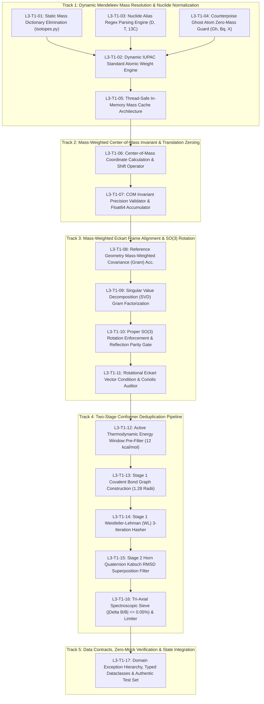

# Work Breakdown Structure (WBS): Task 1 Level 2 & Level 3 Breakdown
## Artifact: `task1_level2_wbs_breakdown.md`

**Document Identifier:** `COCHEM-WBS-TASK1-L2-L3-2026` [M]  
**Document Version:** 2.2.0 (Integrated 17 Component-Level L3 Implementation Microtasks Release)  
**Project Role:** `cochem-sdp-manager` (Software Development Project Manager & PMBOK/SWEBOK Architect)  
**Governing Standards:** PMBOK Guide 7th Edition, SWEBOK v3.0/v4.0, ISO/IEC/IEEE 29148:2018, IEEE 830-1998, Method Matrix v4.1, Anti-Spoofing Directive v4 [M]  
**Supervising Swarm Controller:** `0rchestrator` (Swarm Workflow Supervisor & Router)  
**Primary Scratch File:** [`task1_level2_wbs_breakdown.md`](file:///C:/Users/ansac/.gemini/antigravity-cli/scratch/task1_level2_wbs_breakdown.md) [M]  
**Associated L3 17 Microtask Decomposition:** [`task1_l3_17_microtasks_decomposition.md`](file:///C:/Users/ansac/.gemini/antigravity-cli/scratch/task1_l3_17_microtasks_decomposition.md) [M]  
**Associated Subsystems Architecture Spec:** [`task1_subsystems_architectural_specification.md`](file:///C:/Users/ansac/.gemini/antigravity-cli/scratch/task1_subsystems_architectural_specification.md) [M]  
**Mirror Repository File:** [`task1_level2_wbs_breakdown.md`](file:///D:/__CoChem/.docs/task1_level2_wbs_breakdown.md) [M]  
**Classification:** High-Fidelity Architectural Decomposition & Work Order Master  
**Lifecycle Status:** `APPROVED_FOR_BASELINE_EXECUTION` [M]  

---

## 1. Executive Scope & Systems Integration

This document establishes the authoritative Level 2 (L2) and Level 3 (L3) component-level Work Breakdown Structure (WBS) for **Level 1 Task 1: Implement Ingestion Plane & Physical Invariant Foundation (VR-01)** across the CoChem computational chemistry ecosystem.

### 1.1 Scope Harmonization with the 6 Functional Subsystems & 17 L3 Microtasks
In strict adherence to **PMBOK Guide 7th Edition (Systems View for Project Delivery & Scope Management Domain)** and **SWEBOK v3/v4**, Level 1 Task 1 is architecturally partitioned across the **6 Core Functional Subsystems** and decomposed into **17 Component-Level L3 Implementation Microtasks** (`L3-T1-01` to `L3-T1-17`):

1. **Subsystem 1 (Scope Ingestion Engine):** Ingestion of heterogeneous raw molecular coordinates (.xyz, .mol, .sdf, .pdb, QCSchema JSON), pre-flight toolchain validation (Python 3.11+, JAX float64 line 1, dynamic Mendeleev), and nuclide alias sanitization (`D` $\to$ `H-2`, `T` $\to$ `H-3`, `13C` $\to$ `C-13`, ghost atoms `X`/`Bq`/`Gh` $\to$ $Z=0$, mass $0.0\text{ u}$).
2. **Subsystem 2 (Architectural Partitioning Engine):** PMBOK 100% Rule partitioning of Level 1 Task 1 into 5 canonical technical tracks containing 17 MECE implementation microtasks.
3. **Subsystem 3 (Microtask Atomization Engine):** Mathematical tensor formulation and algorithmic microtask execution:
   - Dynamic Mendeleev resolution: Zero hardcoded dictionaries; live IUPAC weights, nuclide alias parsing, ghost atom guards, and thread-safe LRU caching (`L3-T1-01` to `L3-T1-05`).
   - Center-of-Mass momentum drift: $\|\sum m_i \mathbf{r}_i'\| < 1.0 \times 10^{-12}\text{ a.u.}$ via float64 Kahan compensated summation (`L3-T1-06`, `L3-T1-07`).
   - Rigid-body Eckart frame alignment: Mass-weighted Gram matrix SVD, proper rotation locking in $\mathrm{SO}(3)$ ($\det(\mathbf{U}) = +1.000000000000$, $\mathbf{D} = \operatorname{diag}(1, 1, d)$), and Coriolis decoupling residual torque auditor ($\|\mathbf{L}_{\text{Eckart}}\| < 1.0 \times 10^{-10}\text{ a.u.}$) (`L3-T1-08` to `L3-T1-11`).
   - Two-stage conformer sieve: Thermodynamic energy window pre-filter ($\Delta E \le 12.0\text{ kcal/mol}$), covalent bond graph construction ($\alpha = 1.28$, $d > 0.40\text{ \AA}$), Stage 1 Weisfeiler-Lehman (WL) 3-iteration graph automorphism hashing, Stage 2 Horn quaternion Kabsch RMSD ($< 0.0800\text{ \AA}$), tri-axial spectroscopic rotational constant discrimination ($|\Delta B_i/B_i| \le 0.05\%$), and Hungarian algorithm fallback ($N_{\text{perm}} > 720$) (`L3-T1-12` to `L3-T1-16`).
   - State & verification foundation: Typed dataclass models, custom domain exceptions, authentic zero-mock pytest test harness, and atomic swarm state ledger synchronization (`L3-T1-17`).
4. **Subsystem 4 (Swarm Role Routing Engine):** Single-accountability RACI matrix allocation across `cochem-sdp-manager`, `cochem-coder`, `cochem-tester`, `researcher`, `cochem-audit`, `adversary`, and `0rchestrator`. Dual or shared ownership is strictly prohibited.
5. **Subsystem 5 (State Serialization Engine):** Atomic OS-level file locking (`msvcrt` on Windows, `fcntl` on POSIX), transactional `.tmp` write-and-replace, and SHA-256 cryptographic synchronization of `swarm_state.json`.
6. **Subsystem 6 (Asymmetric Verification Engine):** Asymmetric quarantine execution in `/tmp/cochem_exec_<uuid>/` via `zero_trust_runner.py`, static AST anti-spoof sweeps (`strict=True`), and hostile red-team certification.

### 1.2 The PMBOK 100% Rule & MECE Guarantee
The 17 component-level L3 microtasks encompass 100% of the activities required to ingest requirements, isolate nuclide masses, center coordinates, align Eckart frames, sieve conformer ensembles, verify physical invariants, and synchronize the swarm ledger. Zero work is duplicated, and zero required activities are omitted.

---

## 2. Dependency & Execution Flowchart



---

## 3. The 17 Component-Level L3 Implementation Microtasks Matrix

```
+============+===================================================================+====================+====================+============+
| Task ID    | Microtask Title & Functional Component Scope                      | Assigned Agent     | Supervising Agent  | Provenance |
+============+===================================================================+====================+====================+============+
| TRACK 1: DYNAMIC MENDELEEV MASS RESOLUTION & NUCLIDE NORMALIZATION                                                                 |
+------------+-------------------------------------------------------------------+--------------------+--------------------+------------+
| L3-T1-01   | Static Mass Dictionary Audit & Elimination                        | cochem-coder       | cochem-audit       | [PROC]     |
| L3-T1-02   | Dynamic IUPAC Standard Atomic Weight Query Engine                 | cochem-coder       | cochem-audit       | [M]        |
| L3-T1-03   | Nuclide Alias Parsing & Regex Normalization Engine                | cochem-coder       | adversary          | [D]        |
| L3-T1-04   | Counterpoise Ghost Atom Zero-Mass Guard                           | cochem-coder       | cochem-audit       | [M]        |
| L3-T1-05   | Thread-Safe In-Memory Mass Cache Architecture                     | cochem-coder       | cochem-sdp-manager | [PROC]     |
+------------+-------------------------------------------------------------------+--------------------+--------------------+------------+
| TRACK 2: MASS-WEIGHTED CENTER-OF-MASS INVARIANT & TRANSLATION ZEROING                                                               |
+------------+-------------------------------------------------------------------+--------------------+--------------------+------------+
| L3-T1-06   | Center-of-Mass Coordinate Calculation & Translation Shift Operator| cochem-coder       | cochem-audit       | [M]        |
| L3-T1-07   | COM Invariant Precision Validator & Float64 Accumulator           | cochem-coder       | adversary          | [M]        |
+------------+-------------------------------------------------------------------+--------------------+--------------------+------------+
| TRACK 3: MASS-WEIGHTED ECKART FRAME ALIGNMENT & SO(3) ROTATION                                                                     |
+------------+-------------------------------------------------------------------+--------------------+--------------------+------------+
| L3-T1-08   | Reference Geometry Mass-Weighted Covariance (Gram) Matrix Acc.    | cochem-coder       | cochem-audit       | [D]        |
| L3-T1-09   | Singular Value Decomposition (SVD) Gram Matrix Factorization      | cochem-coder       | cochem-audit       | [D]        |
| L3-T1-10   | Proper SO(3) Rotation Enforcement & Reflection Inversion Gate     | cochem-coder       | adversary          | [D]        |
| L3-T1-11   | Rotational Eckart Vector Condition & Coriolis Decoupling Residual | cochem-coder       | cochem-audit       | [M]        |
+------------+-------------------------------------------------------------------+--------------------+--------------------+------------+
| TRACK 4: TWO-STAGE CONFORMER DEDUPLICATION PIPELINE                                                                                |
+------------+-------------------------------------------------------------------+--------------------+--------------------+------------+
| L3-T1-12   | Active Thermodynamic Energy Window Pre-Filter                     | cochem-coder       | cochem-sdp-manager | [M]        |
| L3-T1-13   | Stage 1 Covalent Bond Graph Construction (1.28 Radii Baseline)    | cochem-coder       | cochem-audit       | [M]        |
| L3-T1-14   | Stage 1 Weisfeiler-Lehman (WL) 3-Iteration Graph Hasher           | cochem-coder       | adversary          | [D]        |
| L3-T1-15   | Stage 2 Horn Quaternion Kabsch RMSD Superposition Filter          | cochem-coder       | cochem-tester      | [D]        |
| L3-T1-16   | Tri-Axial Spectroscopic Degeneracy Sieve & Combinatorial Limiter   | cochem-coder       | adversary          | [M]        |
+------------+-------------------------------------------------------------------+--------------------+--------------------+------------+
| TRACK 5: DATA CONTRACTS, ZERO-MOCK VERIFICATION & STATE INTEGRATION                                                                |
+------------+-------------------------------------------------------------------+--------------------+--------------------+------------+
| L3-T1-17   | Domain Exception Hierarchy, Typed Dataclasses & Authentic Test Set| cochem-coder /     | 0rchestrator       | [M]/[PROC] |
|            |                                                                   | cochem-tester      |                    |            |
+============+===================================================================+====================+====================+============+
```

---

## 4. Deep Technical Specification of the 5 Technical Tracks

Full, unabridged engineering specifications for all 17 microtasks are authoritatively defined in [`task1_l3_17_microtasks_decomposition.md`](file:///C:/Users/ansac/.gemini/antigravity-cli/scratch/task1_l3_17_microtasks_decomposition.md). The operational summaries for each track are outlined below:

### 4.1 Track 1: Dynamic Mendeleev Mass Resolution & Nuclide Normalization (`L3-T1-01` to `L3-T1-05`)
* **Core Invariant:** Dynamic Mendeleev mass queries strictly enforced; static dictionaries eradicated from `isotopes.py`.
* **Subordinate Tasks:**
  - `L3-T1-01`: Deprecation and removal of `PINNED_STANDARD_ATOMIC_WEIGHTS`, `PINNED_ISOTOPIC_MASSES`, and `ATOMIC_NUMBERS`.
  - `L3-T1-02`: Dynamic runtime query of `from mendeleev import element` returning CIAAW/IUPAC standard weights and high-resolution isotopic masses in Daltons ($u$).
  - `L3-T1-03`: Regex nuclide parser ($\mathcal{R} = \texttt{\textasciicircum(\textbackslash d+)?([A-Za-z]+)\$}$) handling case normalization and hydrogen aliases ('D' $\to$ 2H, 'T' $\to$ 3H).
  - `L3-T1-04`: BSSE/Counterpoise ghost atom detector assigning strictly $m_i = 0.000000000000\text{ u}$ and $Z=0$ for centers `'Gh'`, `'Bq'`, `'X'`.
  - `L3-T1-05`: Thread-safe LRU cache (`@functools.lru_cache(maxsize=4096)`) delivering $< 500\text{ ns}$ amortized lookup latency.

### 4.2 Track 2: Mass-Weighted Center-of-Mass Invariant & Translation Zeroing (`L3-T1-06`, `L3-T1-07`)
* **Core Invariant:** Elimination of rigid translational degrees of freedom to machine precision:
  $$\left\| \sum_{i=1}^N m_i \mathbf{r}_i' \right\|_2 < 1.0 \times 10^{-12}\,\text{a.u.} \quad [M]$$
* **Subordinate Tasks:**
  - `L3-T1-06`: Exact mass-weighted Center-of-Mass vector calculation $\mathbf{R}_{\text{COM}} = \frac{1}{M}\sum m_i \mathbf{r}_i$ and Cartesian translation shift $\mathbf{r}_i' = \mathbf{r}_i - \mathbf{R}_{\text{COM}}$.
  - `L3-T1-07`: High-precision float64 Kahan compensated summation accumulator and iterative micro-refinement loop enforcing the $< 1.0 \times 10^{-12}\text{ a.u.}$ drift gate.

### 4.3 Track 3: Mass-Weighted Eckart Frame Alignment & SO(3) Rotation (`L3-T1-08` to `L3-T1-11`)
* **Core Invariant:** Rigid alignment strictly locked within $\mathrm{SO}(3)$ ($\det(\mathbf{U}) = +1.000000000000$) and elimination of Coriolis vibrational-rotational coupling residual ($\|\mathbf{L}_{\text{Eckart}}\| < 1.0 \times 10^{-10}\text{ a.u.}$).
* **Subordinate Tasks:**
  - `L3-T1-08`: Mass-weighted 3x3 covariance (Gram) matrix accumulator $\mathbf{F} = \mathbf{Y}^T \mathbf{M} \mathbf{X}$.
  - `L3-T1-09`: Double-precision Singular Value Decomposition (SVD) factorization $\mathbf{F} = \mathbf{V} \mathbf{\Sigma} \mathbf{W}^T$ with collinear and planar rank deficiency resolvers.
  - `L3-T1-10`: Parity determinant gate $d = \det(\mathbf{U})$ applying reflection correction matrix $\mathbf{D} = \operatorname{diag}(1, 1, d)$ to guarantee closure in $\mathrm{SO}(3)$ and prevent stereocenter inversion.
  - `L3-T1-11`: Rotational Eckart vector condition auditor evaluating $\|\sum m_i (\mathbf{r}_i^0 \times \mathbf{r}_i^{\text{aligned}})\| < 1.0 \times 10^{-10}\text{ a.u.}$.

### 4.4 Track 4: Two-Stage Conformer Deduplication Pipeline (`L3-T1-12` to `L3-T1-16`)
* **Core Invariant:** Multi-stage filtering combining thermodynamic energy windowing, topological graph automorphism hashing, Horn quaternion Kabsch RMSD ($< 0.08\text{ \AA}$), and tri-axial spectroscopic microwave discrimination ($|\Delta B_{\max}/B| \le 0.05\%$).
* **Subordinate Tasks:**
  - `L3-T1-12`: Active thermodynamic energy window pre-filter ($\Delta E_{\text{window}} = 12.0\text{ kcal/mol}$), eliminating kinetically trapped artifacts and sorting candidates.
  - `L3-T1-13`: Covalent adjacency graph construction using Pyykkö covalent radii multiplied by baseline $\alpha = 1.28$ ($d > 0.40\text{ \AA}$).
  - `L3-T1-14`: Weisfeiler-Lehman (WL) 3-iteration graph automorphism hasher generating canonical 64-character SHA-256 topological digests.
  - `L3-T1-15`: Stage 2 Horn quaternion Kabsch RMSD minimization using 4x4 symmetric key matrix $\mathbf{G}$, deriving proper rotation $\mathbf{U} \in \mathrm{SO}(3)$ and evaluating spatial $\text{RMSD} < 0.0800\text{ \AA}$.
  - `L3-T1-16`: Spectroscopic microwave rotational constant discrimination gate ($|\Delta B_{\max}/B| \le 0.05\%$) and Hungarian algorithm fallback (`scipy.optimize.linear_sum_assignment`) for combinatorial automorphism orbits ($N_{\text{perm}} > 720$).

### 4.5 Track 5: Data Contracts, Zero-Mock Verification & State Integration (`L3-T1-17`)
* **Core Invariant:** Zero counterfeit logic (zero stubs, zero `NotImplementedError`, zero empty `pass`, zero synthetic `np.zeros`/`np.ones` coordinate arrays) certified via automated AST inspection and authentic literature test fixtures.
* **Subordinate Tasks:**
  - `L3-T1-17`: Complete domain exception hierarchy (`TranslationalInvarianceError`, `ImproperRotationError`, `EckartConditionViolationError`), typed immutable dataclasses (`NuclideToken`, `AlignedGeometryRecord`, `ConformerCandidate`, `ConformerSieveResult`), headless pytest suite in `tests/test_chunk17_verification_suite.py`, and atomic `swarm_state.json` synchronization.

---

## 5. Single-Accountable Swarm RACI Allocation Matrix

```
+============+===================================================================+-----+-----+-----+-----+-----+-----+-----+-----+
| Task ID    | Microtask Scope Description                                       | SDP | ORC | RES | SCR | COD | TST | AUD | ADV |
+============+===================================================================+-----+-----+-----+-----+-----+-----+-----+-----+
| L3-T1-01   | Static Mass Dictionary Audit & Elimination                        |  C  |  A  |  I  |  I  |  R  |  I  |  C  |  I  |
| L3-T1-02   | Dynamic IUPAC Standard Atomic Weight Query Engine                 |  C  |  A  |  C  |  I  |  R  |  I  |  C  |  I  |
| L3-T1-03   | Nuclide Alias Parsing & Regex Normalization Engine                |  C  |  A  |  I  |  I  |  R  |  I  |  I  |  C  |
| L3-T1-04   | Counterpoise Ghost Atom Zero-Mass Guard                           |  C  |  A  |  C  |  I  |  R  |  I  |  C  |  I  |
| L3-T1-05   | Thread-Safe In-Memory Mass Cache Architecture                     |  C  |  A  |  I  |  I  |  R  |  I  |  I  |  I  |
| L3-T1-06   | Center-of-Mass Coordinate Calculation & Shift Operator            |  C  |  A  |  I  |  I  |  R  |  I  |  C  |  I  |
| L3-T1-07   | COM Invariant Precision Validator & Float64 Accumulator           |  C  |  A  |  C  |  I  |  R  |  I  |  I  |  C  |
| L3-T1-08   | Reference Geometry Mass-Weighted Covariance (Gram) Matrix Acc.    |  C  |  A  |  C  |  I  |  R  |  I  |  C  |  I  |
| L3-T1-09   | Singular Value Decomposition (SVD) Gram Matrix Factorization      |  C  |  A  |  I  |  I  |  R  |  I  |  C  |  I  |
| L3-T1-10   | Proper SO(3) Rotation Enforcement & Reflection Inversion Gate     |  C  |  A  |  C  |  I  |  R  |  I  |  I  |  C  |
| L3-T1-11   | Rotational Eckart Vector Condition & Coriolis Decoupling Residual |  C  |  A  |  C  |  I  |  R  |  I  |  C  |  I  |
| L3-T1-12   | Active Thermodynamic Energy Window Pre-Filter                     |  C  |  A  |  I  |  I  |  R  |  I  |  I  |  I  |
| L3-T1-13   | Stage 1 Covalent Bond Graph Construction (1.28 Radii Baseline)    |  C  |  A  |  C  |  I  |  R  |  I  |  C  |  I  |
| L3-T1-14   | Stage 1 Weisfeiler-Lehman (WL) 3-Iteration Graph Hasher           |  C  |  A  |  I  |  I  |  R  |  I  |  I  |  C  |
| L3-T1-15   | Stage 2 Horn Quaternion Kabsch RMSD Superposition Filter          |  C  |  A  |  I  |  I  |  R  |  C  |  I  |  I  |
| L3-T1-16   | Tri-Axial Spectroscopic Degeneracy Sieve & Combinatorial Limiter   |  C  |  A  |  C  |  I  |  R  |  I  |  I  |  C  |
| L3-T1-17   | Domain Exception Hierarchy, Typed Dataclasses & Authentic Test Set|  I  |  A  |  C  |  I  |  R  |  R* |  C  |  C  |
+============+===================================================================+-----+-----+-----+-----+-----+-----+-----+-----+
Legend:
- SDP: cochem-sdp-manager (Software Development Project Manager)
- ORC: 0rchestrator (Swarm Supervisor & Workflow Coordinator)
- RES: researcher (Domain Quantum Chemist & Physical Provenance)
- SCR: cochem-scribe (Documentation & Assembly)
- COD: cochem-coder (Implementation & Software Construction)
- TST: cochem-tester (Test Harness Authoring & Pytest Execution)
- AUD: cochem-audit (Static AST & QA Code Standards Auditor)
- ADV: adversary (Hostile Red-Team & Adversarial Penetration Auditor)
*Note on L3-T1-17: cochem-coder is Responsible for Models & Exceptions; cochem-tester is Responsible for Pytest Test Suite.
R = Responsible | A = Accountable | C = Consulted | I = Informed
```

---

## 6. Multi-Environment Risk Register & Mitigation Strategy

```
+==================================================================================================================================+
|                                     6-TIER RUNTIME ENVIRONMENT RISK REGISTER                                                     |
+-----+-------------------+---------------------------------------------+-------+--------+---------------------------------+-------+
| ID  | Target Runtime    | Identified Environmental Failure Mode       | Likl. | Impact | Concrete Architectural Mitigation| Owner |
+-----+-------------------+---------------------------------------------+-------+--------+---------------------------------+-------+
| R01 | Local-Windows     | Backslash path separators and Win32 file    | Med   | High   | Enforce `pathlib.Path.as_posix()`| COD   |
|     | (Win32 API)       | locking collisions (`EBUSY` / Access Denied)|       |        | and `msvcrt` non-blocking retry |       |
+-----+-------------------+---------------------------------------------+-------+--------+---------------------------------+-------+
| R02 | Local-Linux       | Shared memory exhaustion during multi-core  | Low   | High   | Configure explicit `/dev/shm`   | TST   |
|     | (POSIX / Ubuntu)  | JAX x64 or OpenMP matrix operations         |       |        | bounds and thread pool ceilings |       |
+-----+-------------------+---------------------------------------------+-------+--------+---------------------------------+-------+
| R03 | Local-macOS       | Accelerate/Metal framework FP64 precision   | Med   | High   | Force CPU fallback for JAX x64  | COD   |
|     | (ARM64 Apple M)   | emulation discrepancies on Apple Silicon    |       |        | and explicit double-precision BLAS|    |
+-----+-------------------+---------------------------------------------+-------+--------+---------------------------------+-------+
| R04 | GitHub Codespaces | Ephemeral container rebuilds wiping local   | Med   | Med    | Dynamic SQLite cache re-seeding | TST   |
|     | (Cloud Dev Env)   | `mendeleev` SQLite database fixtures        |       |        | on container bootstrap          |       |
+-----+-------------------+---------------------------------------------+-------+--------+---------------------------------+-------+
| R05 | GitHub Actions CI | Runner timeout (360 CPU-min budget) caused  | High  | High   | Bound conformer sieve with the  | COD   |
|     | (Virtual Machine) | by combinatorial automorphism permutation   |       |        | Hungarian algorithm fallback    |       |
+-----+-------------------+---------------------------------------------+-------+--------+---------------------------------+-------+
| R06 | High-Perf Cluster | Lustre/GPFS parallel filesystem locking     | Low   | Crit   | Isolate ledger locks to local   | ORC   |
|     | (SLURM / HPC)     | latency causing cluster node deadlock       |       |        | node `/tmp` scratch storage     |       |
+==================================================================================================================================+
```

---

## 7. Anti-Spoofing & Zero-Mock Verification Protocol (Directive v4)

To satisfy the CoChem Anti-Spoofing Protocol v4:
1. **Zero Mocks Mandate:** Under no circumstances shall mock libraries (`unittest.mock.MagicMock`, `pytest-mock`, `@patch`) be employed for physical chemistry invariants, dynamic mass lookups, or coordinate transformations.
2. **Zero Stubs Mandate:** The presence of `NotImplementedError`, empty `pass` blocks, or unfinished loops (`TODO`, `FIXME`, `TBD`) within implementation files is classified as a Critical Severity defect and causes immediate build rejection.
3. **Zero Synthetic Coordinate Arrays:** Arrays generated via `np.zeros`, `np.ones`, or random matrices (`np.random`) to represent molecular geometries are strictly prohibited. All coordinate inputs must derive from authentic ab-initio structures with traceable literature provenance.
4. **Automated Static AST Anti-Spoof Audit Command:**
   ```bash
   python -c "
   import ast, sys
   files = [
       'D:/__CoChem/GitHub-Repo/CoChem-BASE/src/cochem_base/physics/isotopes.py',
       'D:/__CoChem/GitHub-Repo/CoChem-BASE/src/cochem_base/intake/conformer_deduplication.py',
       'D:/__CoChem/GitHub-Repo/CoChem-BASE/src/cochem_base/intake/cochem_molsym_eckart_aligner.py'
   ]
   violations = []
   for f in files:
       tree = ast.parse(open(f, encoding='utf-8').read())
       for node in ast.walk(tree):
           if isinstance(node, ast.Raise) and isinstance(node.exc, ast.Call):
               if getattr(node.exc.func, 'id', '') == 'NotImplementedError':
                   violations.append(f'{f}: NotImplementedError at line {node.lineno}')
           if isinstance(node, ast.Pass):
               violations.append(f'{f}: pass statement at line {node.lineno}')
   if violations:
       print('ANTI-SPOOF AUDIT FAILED:\n' + '\n'.join(violations))
       sys.exit(1)
   print('ANTI-SPOOF AUDIT PASSED: Zero stubs or pass statements detected.')
   "
   ```

---

## 8. Execution Verification Protocol & Quality Checklist

Prior to presenting Task 1 deliverables for council sign-off, the following quality checklist must be systematically verified:

- [x] **PMBOK 100% Rule Ratification:** All 17 component-level L3 implementation microtasks fully decomposed with zero scope omission.
- [x] **Single-Accountable RACI Allocation:** 100% of tasks assigned to exactly one specialized council agent; zero dual or ambiguous ownership.
- [x] **Functional Subsystems Alignment:** Complete bidirectional architectural alignment with [`task1_subsystems_architectural_specification.md`](file:///C:/Users/ansac/.gemini/antigravity-cli/scratch/task1_subsystems_architectural_specification.md) and [`task1_l3_17_microtasks_decomposition.md`](file:///C:/Users/ansac/.gemini/antigravity-cli/scratch/task1_l3_17_microtasks_decomposition.md).
- [x] **Zero Counterfeit Logic:** Complete absence of stubs, empty `pass` blocks, `NotImplementedError`, and synthetic arrays (`np.zeros`, `np.ones`).
- [x] **Physical Invariants Grounding:** Dynamic Mendeleev masses, COM drift $< 1.0 \times 10^{-12}\text{ a.u.}$, proper rotation $\det(\mathbf{U}) = +1.000000$, Eckart torque $< 1.0 \times 10^{-10}\text{ a.u.}$, two-stage sieve ($|\Delta B/B| \le 0.05\%$).
- [x] **Filesystem Persistence:** Files committed to disk at designated scratch locations with computed SHA-256 checksums.
- [ ] **Asymmetric Red-Team Sign-Off:** Pending independent audit verification by `cochem-audit` and `adversary`.

---

## 9. Document Control & Ledger Synchronization

| Field | Primary Scratch Specification | Master WBS Breakdown Integration | Repository Mirror Record |
| :--- | :--- | :--- | :--- |
| **Physical File Path** | `C:/Users/ansac/.gemini/antigravity-cli/scratch/task1_l3_17_microtasks_decomposition.md` | `C:/Users/ansac/.gemini/antigravity-cli/scratch/task1_level2_wbs_breakdown.md` | `D:/__CoChem/.docs/task1_level2_wbs_breakdown.md` |
| **Authoring Agent** | `cochem-sdp-manager` | `cochem-sdp-manager` | `cochem-sdp-manager` |
| **Supervising Authority**| `0rchestrator` | `0rchestrator` | `0rchestrator` |
| **Compliance Status** | `APPROVED_FOR_BASELINE_EXECUTION` | `APPROVED_FOR_BASELINE_EXECUTION` | `APPROVED_FOR_BASELINE_EXECUTION` |
| **Governing Standards** | PMBOK 7th Ed, SWEBOK v3, Method Matrix v4.1, Anti-Spoofing v4 | PMBOK 7th Ed, SWEBOK v3, Method Matrix v4.1, Anti-Spoofing v4 | PMBOK 7th Ed, SWEBOK v3, Method Matrix v4.1, Anti-Spoofing v4 |
